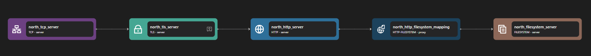

# Filesystem Server Binding

The filesystem `server` binding provides access to files and directories on the local filesystem, optionally following symbolic links. It behaves as a web server when combined with `tcp,` `tls`, `http` and `http-filesystem` bindings.

## Usage

```yaml {3}
<!-- @include: ./.partials/server.yaml -->
```

## Usage Example



::: details Full HTTP Filesystem zilla.yaml Config

```yaml
<!-- @include: ../.partials/filesystem-zilla.yaml -->
```

:::

In the above example, the Filesystem server binding provides a bridge for accessing mapped files and directories. Currently, it supports adapters from HTTP protocols.

1. HTTP Server sends the stream to HTTP-Filesystem binding.
2. HTTP Filesystem adapts the HTTP request stream into the Filesystem request stream.
3. The Filesystem Server then serves the filesystem stream request.

## Configuration (\* required)

::: tabs

@tab options

<!-- @include: ./.partials/options.md -->

@tab telemetry

<!-- @include: ../.partials/telemetry.md -->

:::
