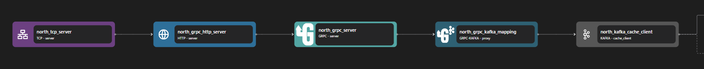

# gRPC Kafka Proxy Binding

The grpc-kafka proxy binding adapts `grpc` request-response streams to `kafka` topic streams.

```yaml {3}
<!-- @include: ./.partials/proxy.yaml -->
```

## Usage Example



::: details Full gRPC Proxy zilla.yaml Config

```yaml
<!-- @include: ../../../cookbooks/quickstart/grpc-zilla.yaml -->
```

:::

In the above example, the gRPC-Kafka binding is an intermediary between gRPC Server binding and Kafka Client binding. Some routing, transformation, data injection, etc can be done here before the stream is passed into the Kafka client.

1. gRPC Server sends the stream to gRPC-Kafka binding.
2. gRPC Kafka performs the necessary transformation between the gRPC stream and the Kafka stream.
3. The transformed stream is then forwarded to Kafka Client.

## Configuration (\* required)

::: tabs

@tab options

<!-- @include: ./.partials/kafka-options.md -->

@tab routes\*

<!-- @include: ./.partials/kafka-routes.md -->

@tab telemetry
<!-- @include: ../.partials/telemetry-grpc.md -->

:::
