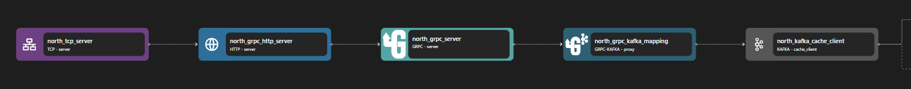

# gRPC Server Binding

The grpc server binding adapts `http` request-response streams to `grpc` request-response streams, with support for both `application/grpc+proto` and `application/grpc-web+proto` content types.

```yaml {4-6,9-13}
<!-- @include: ./.partials/server.yaml -->
```

## Usage Example



::: details Full gRPC Proxy zilla.yaml Config

```yaml
<!-- @include: ../../../cookbooks/quickstart/grpc-zilla.yaml -->
```

:::

In the above example, the gRPC Server receives inbound HTTP streams from the HTTP Server binding. The gRPC Server binding parses the incoming gRPC request and then converts it into higher application streams. Some routing, transformation, validation, etc can be done here before the stream is continued into the next pipeline.

1. gRPC Server receives inbound stream from HTTP Server.
2. The decoded gRPC request is then converted into different protocols, such as gRPC Kafka Proxy.
3. The gRPC Kafka Proxy binding receives the gRPC request stream and acts as an adaptor from the gRPC stream to the Kafka protocol.

::: info Note
The gRPC utilizes HTTP/2 in its underlying mechanism, so it needs a data stream coming from an HTTP Server instead of directly from a TCP Server.
:::

## Configuration (\* required)

::: tabs

@tab catalog

<!-- @include: ./.partials/catalog.md -->

@tab routes\*

<!-- @include: ./.partials/routes.md -->

@tab exit

<!-- @include: ../.partials/exit.md -->

@tab telemetry
<!-- @include: ../.partials/telemetry-grpc.md -->

:::
