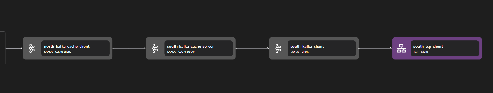

# Kafka Client

The `client` kind `kafka` binding receives inbound application streams and encodes each as a network stream via `kafka` request-response protocol. Note that the same network stream can be reused to encode multiple `kafka` requests, including both `fetch` and `produce` requests.

Conditional routes based on `kafka` `topic` names are used to route these network streams to an `exit` binding that ultimately reaches a `kafka` broker.

```yaml {3}
<!-- @include: ./.partials/client.yaml -->
```

## Usage Example



::: details Full HTTP Proxy zilla.yaml Config

```yaml
<!-- @include: ../../../cookbooks/quickstart/http-zilla.yaml -->
```

:::

In the above example, the Kafka Client encodes the Kafka request stream via the `Kafka` request-response protocol. It connects Zilla with a Kafka instance.

1. Kafka Client connects to a Kafka instance. It connects to a TCP Client either directly or via a TLS Binding.
2. Kafka Client receives inbound request stream and forwards it into the Kafka instance. It can receive streams directly from a Kafka adapter (e.g. HTTP Kafka) or via Kafka Cache Server.

## Configuration (\* required)

::: tabs

@tab options

<!-- @include: ./.partials/client-options.md -->

@tab routes\*

<!-- @include: ./.partials/routes.md -->

@tab exit

<!-- @include: ../.partials/exit.md -->

@tab telemetry

<!-- @include: ../.partials/telemetry.md -->

:::
