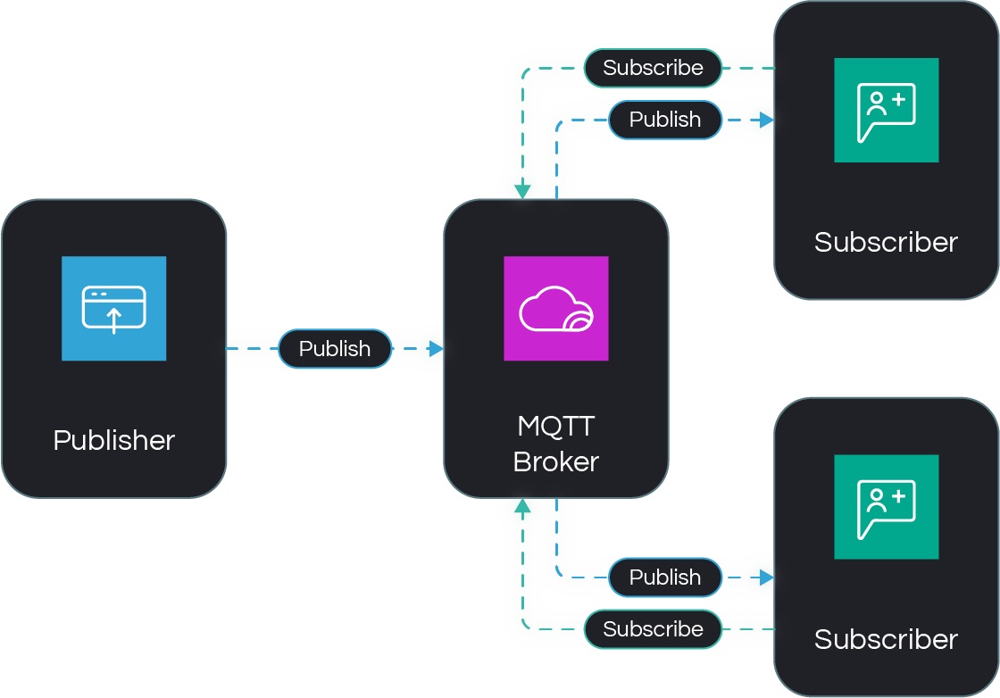
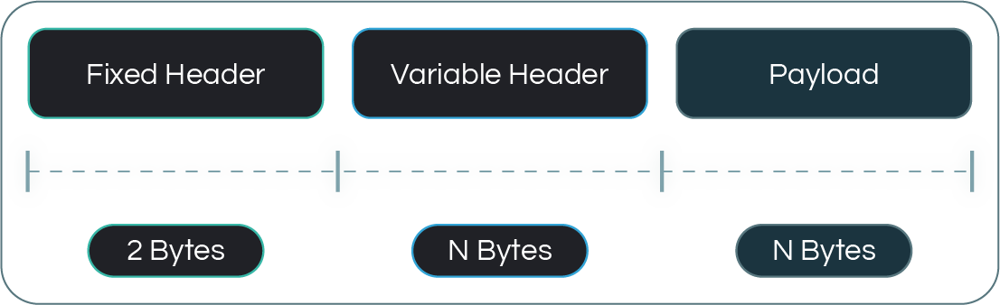

# MQTT Protocol

## Introduction

Zilla supports **MQTT (Message Queuing Telemetry Transport)** as a **protocol binding**, designed for efficient, lightweight, and reliable messaging in modern distributed systems. MQTT operates over TCP/IP and is optimized for low-bandwidth, high-latency, or unreliable networks, making it ideal for IoT, real-time telemetry, and event-driven architectures. With features like publish-subscribe messaging, Quality of Service (QoS) levels, and persistent session support, MQTT enables scalable and resilient communication between devices and services.

## MQTT Communication Workflow

### MQTT Components
MQTT operates on a publish-subscribe model and consists of the following key components:
1. **Broker**: The central server that receives, filters, and distributes messages between clients.
2. **Publisher**: A client that sends messages to a specified topic on the broker.
3. **Subscriber**: A client that listens for messages on a topic from the broker.
4. **Message**: The data payload sent from a publisher to subscribers via the broker.
5. **Topic**: A hierarchical string that defines where messages are published and subscribed to.
6. **QoS**: The level of guarantee for message delivery, ranging from at-most-once (0) to exactly-once (2).
7. **Session**: The connection state maintained between a client and the broker, tracking subscriptions and queued messages.

### MQTT Connections
1. **Connection Initiation**: The MQTT client sends a CONNECT packet to the broker, requesting a connection.
2. **Connection Acknowledgment**: The broker responds with a CONNACK packet, either confirming or denying the connection request.
3. **Session Establishment**: If the connection is accepted, a session is established between the client and the broker.
4. **Subscription**: The client sends SUBSCRIBE packets to the broker to register its interest in specific topics. The broker then responds with SUBACK packets, confirming the client's subscriptions.
5. **Publishing**: The client sends PUBLISH packets to the broker to send messages on specific topics. The broker then forwards the published messages to all clients subscribed to the corresponding topics.
6. **Maintaining the Connection**: The client and broker exchange PINGREQ and PINGRESP packets to ensure the connection remains active.
7. **Disconnection**: Either the client or the broker can initiate disconnection by sending a DISCONNECT packet.

### MQTT Packet Structure

1. **Fixed header** – The mandatory part of an MQTT packet that includes essential control information.
    - **Control field** – Specifies the MQTT packet type and flags for message handling.
    - **Remaining length** – Indicates the number of bytes following the fixed header, including the variable header and payload.
2. **Variable header** – An optional section that contains additional information depending on the packet type, such as packet identifiers or topic names.
3. **Payload** – The actual data being transmitted, which varies based on the packet type and may contain messages, topic filters, or authentication data.1. 

## Supported Versions

- [MQTT v3.1.1](https://docs.oasis-open.org/mqtt/mqtt/v3.1.1/os/mqtt-v3.1.1-os.html)
- [MQTT v5.0](https://docs.oasis-open.org/mqtt/mqtt/v5.0/mqtt-v5.0.html)

### Differences Between MQTT v3.1.1 and MQTT v5.0

| Feature                     | MQTT 3.1.1                                  | MQTT 5.0                                      |
|-----------------------------|---------------------------------------------|-----------------------------------------------|
| **Error Reporting**         | Limited error reporting                     | Extended reason codes for detailed responses      |
| **Session Expiry**          | No session expiry option                    | Allows configurable session expiry time        |
| **Authentication**          | Uses simple username/password               | Uses AUTH packet that supports challenge-response authentication |
| **Message Handling**        | Limited payload description                 | Payload format indicator, content type, topic aliases |

## Security

### Securing MQTT with TLS

MQTT is a lightweight messaging protocol widely used for IoT communication. To ensure secure data transmission, it is essential to encrypt MQTT traffic using TLS (Transport Layer Security). This prevents unauthorized interception, data tampering, and man-in-the-middle (MITM) attacks.

Zilla provides support for [TLS bindings](https://docs.aklivity.io/zilla/latest/reference/config/bindings/tls/) to enforce secure communication between MQTT clients and brokers, ensuring that all messages are encrypted in transit.

### JWT Guard
A client connection to the MQTT server can be guarded by the [jwt](https://docs.aklivity.io/zilla/latest/reference/config/guards/jwt.html) guard supporting JWT access tokens, with fine-grained privileges enforced on publish or subscribe to MQTT topics.

## Zilla: Beyond Standard MQTT

Zilla enhances traditional MQTT workflows by integrating advanced validation, seamless protocol bridging, and dynamic access control.

- **Data Governance**: Validate MQTT topics, payloads, and headers with [Schema Registry](https://docs.aklivity.io/zilla/latest/reference/config/catalogs/) support.
- **Protocol Mapping**: Enable seamless pub/sub communication with Kafka through native Kafka Wire Protocol integration.
- **Continuous Authorization**: Enforce continuous authorization with real-time Challenge events to secure message exchanges.

## Zilla: MQTT Use Cases

Zilla leverages MQTT Protocol to provide efficient message brokering, real-time event streaming, and reliable device communication.

- **MQTT Kafka Proxy**
  - [Broker](https://github.com/aklivity/zilla-examples/tree/main/mqtt.kafka.broker)
  - [Broker with JWT](https://github.com/aklivity/zilla-examples/tree/main/mqtt.kafka.broker.jwt)
  - [Taxi Demo](https://github.com/aklivity/zilla-demos/tree/main/taxi)

## Reference

[mqtt binding](https://docs.aklivity.io/zilla/latest/reference/config/bindings/mqtt/) Defines a binding with `mqtt` protocol support, with `server` or `client` behavior.

[mqtt-kafka binding](https://docs.aklivity.io/zilla/latest/reference/config/bindings/mqtt-kafka/) The `proxy` kind `mqtt-kafka` binding adapts MQTT topic streams to Kafka topic streams .