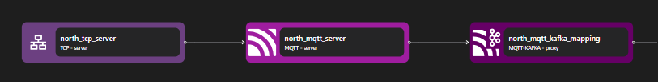

# MQTT-Kafka Proxy

The MQTT-Kafka proxy binding for adapting MQTT topic streams to Kafka topic streams. By configuring the Kafka topics that the proxy will use to route mqtt messages and session states an `mqtt` `server` binding can allow clients to connect and proxy MQTT messages onto Kafka topics.

```yaml {3}
<!-- @include: ./.partials/proxy.yaml -->
```

## Usage Example



::: details Full MQTT zilla.yaml Config

```yaml
<!-- @include: ../../../cookbooks/quickstart/mqtt-zilla.yaml -->
```

:::

In the above example, the MQTT Kafka Proxy acts as an intermediary that converts MQTT messages into Kafka events. This allows MQTT clients to publish messages that can be processed and distributed through Kafka.

1. The MQTT Server receives an inbound connection from a TCP server and decodes the MQTT messages.
2. The decoded MQTT messages are processed and routed as needed.
3. The MQTT Kafka Proxy receives the MQTT stream and translates it into Kafka messages, effectively bridging the MQTT protocol with Kafka.

## Configuration (\* required)

::: tabs

@tab options

<!-- @include: ./.partials/proxy-options.md -->

@tab routes

<!-- @include: ./.partials/proxy-routes.md -->

@tab exit

<!-- @include: ../.partials/exit.md -->

@tab telemetry

<!-- @include: ../.partials/telemetry.md -->

:::