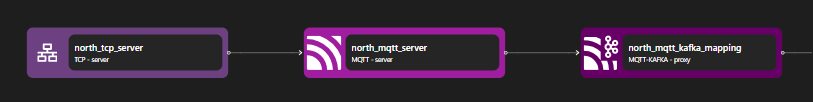

# MQTT Server

The MQTT server binding decodes the MQTT protocol on the inbound network stream, producing higher level application streams for each `publish` or `subscribe` MQTT topic.

```yaml {3}
<!-- @include: ./.partials/server.yaml -->
```

## Usage Example



::: details Full MQTT zilla.yaml Config

```yaml
<!-- @include: ../../../cookbooks/quickstart/mqtt-zilla.yaml -->
```

:::

In the above example, the MQTT Server receives an inbound TCP connection stream from the TCP Server binding. The MQTT Server binding decodes the MQTT request, converting it into a higher-level abstraction in Zilla. Some routing, transformation, validation, etc., can be done here before the stream is continued into the next pipeline.

1. The MQTT Server receives an inbound stream from the TCP Server and decodes the MQTT request.
2. The decoded MQTT request can then be converted into different protocols, such as MQTT Kafka Proxy.
3. The MQTT Kafka Proxy binding receives the MQTT stream and acts as an adaptor from the MQTT protocol to the Kafka protocol.

## Configuration (\* required)

::: tabs

@tab options

<!-- @include: ./.partials/server-options.md -->

@tab routes

<!-- @include: ./.partials/routes.md -->

@tab exit

<!-- @include: ../.partials/exit.md -->

@tab telemetry

<!-- @include: ../.partials/telemetry.md -->

:::