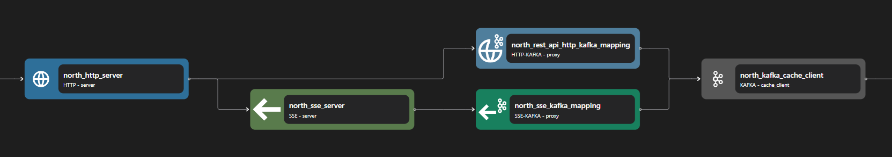

# SSE Kafka Proxy

The sse-kafka proxy binding for adapting `sse` data streams to `kafka` data streams.

```yaml {3}
<!-- @include: ./.partials/proxy.yaml -->
```

## Usage Example



::: details Full HTTP Proxy zilla.yaml Config

```yaml
<!-- @include: ../../../cookbooks/quickstart/http-zilla.yaml -->
```

:::

In the above example, the SSE-Kafka binding is an intermediary between SSE Server binding and Kafka Client (or Kafka Cache Client) binding. Some routing, transformation, data injection, etc can be done here before the stream is passed into the Kafka client.

1. SSE Server sends the stream to SSE-Kafka binding.
2. SSE Kafka performs the necessary transformation between the SSE stream and the Kafka stream.
3. The transformed stream is then forwarded to Kafka Client (or Kafka Cache Client).

## Configuration (\* required)

::: tabs

@tab routes

<!-- @include: ./.partials/proxy-routes.md -->

@tab exit

<!-- @include: ../.partials/exit.md -->

@tab telemetry

<!-- @include: ../.partials/telemetry.md -->

:::
