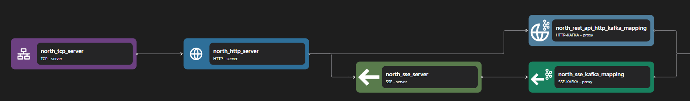

# SSE Server

The sse server binding converts inbound `http` request-response streams into `sse` request-response streams.

```yaml {3}
<!-- @include: ./.partials/server.yaml -->
```

## Usage Example



::: details Full HTTP Proxy zilla.yaml Config

```yaml
<!-- @include: ../../../cookbooks/quickstart/http-zilla.yaml -->
```

:::

In the above example, the SSE Server receives inbound HTTP streams from the HTTP Server binding. The SSE Server binding converts regular HTTP request-response stream into HTTP SSE request-response stream. Some routing, transformation, validation, etc can be done here before the stream is continued into the next pipeline.

1. SSE Server receives inbound stream from HTTP Server. It handles SSE stream request.
2. The decoded SSE request is then converted into different protocols, such as SSE Kafka Proxy.
3. The SSE Kafka Proxy binding receives the SSE stream and acts as an adaptor from the SSE stream to the Kafka protocol.

::: info Note
Server-Sent Event (SSE) is a specific response stream type in HTTP. Because of this, it still requires a data stream from an HTTP Server instead of directly from a TCP Server. The HTTP Server still needs data stream from a TCP server as well.
:::

## Configuration (\* required)

::: tabs

@tab options

<!-- @include: ./.partials/options.md -->

@tab routes

<!-- @include: ./.partials/routes.md -->

@tab exit

<!-- @include: ../.partials/exit.md -->

@tab telemetry

<!-- @include: ../.partials/telemetry.md -->

:::
