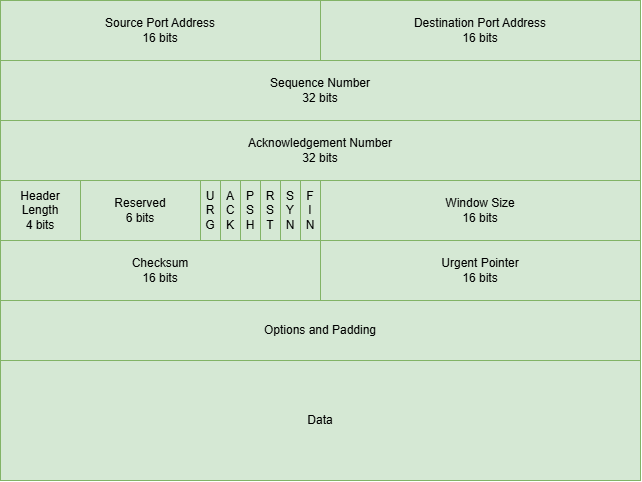
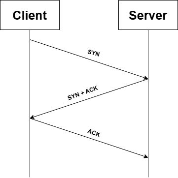
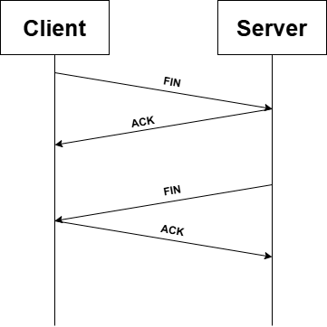

# TCP Protocol

## Introduction

Zilla implements **Transmission Control Protocol (TCP)** as a **first-class protocol binding**, designed to enable reliable, high-performance communication between systems in distributed environments. This empowers Zilla to handle bidirectional, low-latency, and stream-based data exchange, making it ideal for services that require fast and dependable connections, such as IoT devices, real-time data pipelines, and microservices that need direct, high-throughput communication.

## TCP Connection

### TCP Segment Structure

1. **Source Port**: Identifies the sending port on the sender’s side.
2. **Destination Port**: Identifies the receiving port on the receiver’s side.
3. **Sequence Number**: Tracks the position of data in the stream to ensure proper order.
4. **Acknowledgment Number**: Indicates the next expected sequence number to acknowledge receipt.
5. **Data Offset**: Specifies the size of the TCP header to locate the start of the data.
6. **Reserved**: Reserved for future use, ensuring alignment of the header.
7. **Flags**: Control bits (e.g., SYN, ACK, FIN) for managing the connection state.
8. **Window Size**: Defines the size of the sender’s buffer to control flow control.
9. **Checksum**: Used for error-checking the header and data.
10. **Urgent Pointer**: Points to urgent data if the URG flag is set.
11. **Options**: Additional options for advanced TCP features, like timestamp or window scaling.
12. **Data**: Contains the actual application data being transferred.

### TCP Communication Workflow

The following is the summary of how TCP communication works:

1. **Connection Establishment**

    

    TCP communication begins with a three-way handshake to establish a connection between the client and the server:
    - **SYN (Synchronize)**: The client sends a request to the server to establish a connection.
    - **SYN-ACK (Synchronize-Acknowledge)**: The server responds with an acknowledgment of the client's request and its own SYN request.
    - **ACK (Acknowledge)**: The client acknowledges the server's response, and the connection is established.

2. **Data Transmission**
    
    Once the connection is established, the two systems can send data:
    - **Segmentation**: Large data is split into smaller segments and transmitted.
    - **Reliability**: Each segment contains a sequence number, allowing the receiving system to ensure segments are received in the correct order and to request retransmission if any segments are lost.
    - **Flow Control**: TCP uses a sliding window mechanism to control the rate at which data is sent, ensuring the sender doesn’t overwhelm the receiver.
    - **Congestion Control**: TCP adjusts the transmission rate to avoid network congestion.

3. **Connection Termination**

    

    The connection is terminated with a four-way handshake:
    - **FIN (Finish) from Client**: The client sends a request to close the connection.
    - **ACK (Acknowledgment) from Server**: The server acknowledges the termination request.
    - **FIN (Finish) from Server**: The server sends its own request to close the connection.
    - **ACK (Acknowledgment) from Client**: The client acknowledges the termination request.

## Security

### Securing TCP with TLS

TCP, a foundational transport protocol, ensures reliable data transmission but lacks built-in encryption, making it vulnerable to interception and tampering. Encrypting TCP traffic with TLS (Transport Layer Security) enhances security by preventing unauthorized access and protecting against threats like man-in-the-middle (MITM) attacks. By implementing TLS over TCP, applications can establish secure, encrypted communication channels while maintaining data integrity and authentication.

Zilla provides [TLS bindings](https://docs.aklivity.io/zilla/latest/reference/config/bindings/tls/) to enforce secure communication over TCP, ensuring that all transmitted data is encrypted. By integrating TLS with Zilla, organizations can enhance security for various TCP-based applications, protecting sensitive information while maintaining reliable and efficient data exchange.

### Authentication

**Zilla provides [JWT guard](https://docs.aklivity.io/zilla/latest/reference/config/guards/jwt.html) support for securing TCP connections using JWT access tokens**, ensuring only authenticated clients can connect. By enforcing fine-grained privileges, Zilla allows access control based on JWT claims, restricting operations on specific TCP resources. 

## Zilla: TCP Use Cases

Zilla leverages TCP Protocol to provide powerful proxying and reflection services.

- **TCP Proxy**
    - [Echo](https://github.com/aklivity/zilla-examples/tree/main/tcp.echo)
    - [Reflect](https://github.com/aklivity/zilla-examples/tree/main/tcp.reflect)

## Reference

[tcp Binding](https://docs.aklivity.io/zilla/latest/reference/config/bindings/tcp/) The `tcp` support, with `server` or `client` behavior.

