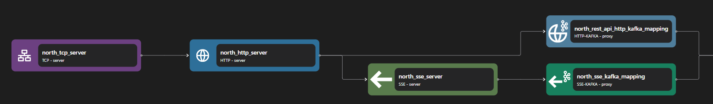

# TCP Server

The tcp server binding listens for inbound socket connections, producing higher level application streams for each remote TCP client.

```yaml {3}
<!-- @include: ./.partials/server.yaml -->
```

## Usage Example



::: details Full HTTP Proxy zilla.yaml Config

```yaml
<!-- @include: ../../../cookbooks/quickstart/http-zilla.yaml -->
```

:::

In the above example, a TCP Server acts as a server that accepts inbound socket connections. It can open one to many ports and can map each connection to different ports into different routes. A TCP server usually acts as an entry point from external connections. The connection will then be passed to the next exit, for example into an HTTP Server.

## Configuration (\* required)

::: tabs

@tab options

<!-- @include: ./.partials/options.md -->

@tab routes

<!-- @include: ./.partials/server-routes.md -->

@tab exit

<!-- @include: ../.partials/exit.md -->

@tab telemetry

<!-- @include: ../.partials/telemetry.md -->

:::
