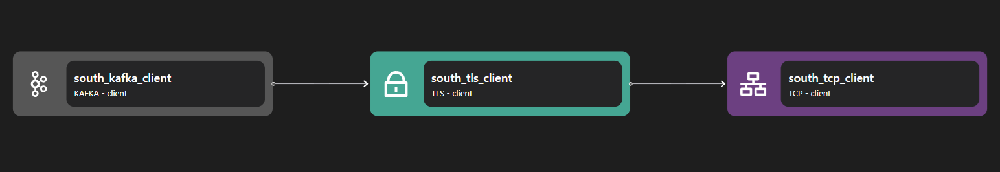

# TLS Client

The tls client binding receives inbound application streams and encodes each as an encrypted network stream via TLS protocol.

```yaml {3}
<!-- @include: ./.partials/client.yaml -->
```

## Usage Example



::: details Full TLS Server zilla.yaml Config

```yaml
<!-- @include: ../.partials/tls-client-zilla.yaml -->
```

:::

In the above example, the TLS Client binding is an adapter for initiating a secure connection to an outbound network, for example initiating an HTTPS connection from an HTTP Client or an encryption Kafka connection from a Kafka Client binding.

1. A client binding (HTTP Client, Kafka Client, etc) initiates an outbound connection stream.
2. The TLS Client handles the outbound stream encryption, forwarding it to the TCP Client.
3. TCP Client initiates the outbound connection to the designated address.

## Configuration (\* required)

::: tabs

@tab vault

<!-- @include: ../.partials/vault.md -->

@tab options

<!-- @include: ./.partials/options.md -->

@tab routes

<!-- @include: ./.partials/routes.md -->

@tab exit

<!-- @include: ../.partials/exit.md -->

@tab telemetry

<!-- @include: ../.partials/telemetry.md -->

:::
