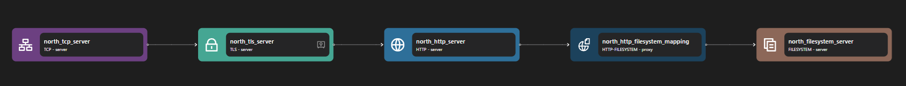

# TLS Server

The tls server binding decodes encrypted TLS protocol on the inbound network stream, producing higher level cleartext application streams for each request.

```yaml {3}
<!-- @include: ./.partials/server.yaml -->
```

## Usage Example



::: details Full TLS Server zilla.yaml Config

```yaml
<!-- @include: ../.partials/filesystem-zilla.yaml -->
```

:::

In the above example, the TLS Server binding is an intermediary between the TCP Server and and corresponding protocol server (HTTP, MQTT, etc). Some routing and encryption configurations can be done here. It is used for providing a server with a secure encrypted connection.

1. An inbound TCP connection is received by the TCP server and forwarded to the TLS server.
2. The TLS server handles the encryption process.
3. The TLS server forwards the decrypted stream into the next binding (in this example an HTTP server).

## Configuration (\* required)

::: tabs

@tab vault

<!-- @include: ../.partials/vault.md -->

@tab options

<!-- @include: ./.partials/options.md -->

@tab routes

<!-- @include: ./.partials/routes.md -->

@tab exit

<!-- @include: ../.partials/exit.md -->

@tab telemetry

<!-- @include: ../.partials/telemetry.md -->

:::
