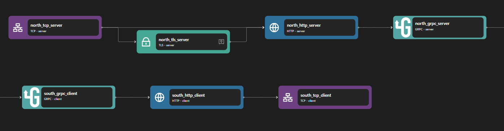

# gRPC Proxy

## Overview

Zilla's gRPC Proxy serves as an intermediary, managing, routing, and validating gRPC traffic between clients and backend services. It utilizes the [grpc](../../../reference/config/bindings/grpc/README.md) binding to handle both server and client behaviors, effectively facilitating seamless communication in distributed systems.


## Key Capabilities

### Inbound and Outbound gRPC Streams

Zilla's gRPC Proxy manages both inbound and outbound gRPC streams, adapting HTTP request-response streams to gRPC request-response streams. The [server](../../../reference/config/bindings/grpc/server.md) kind grpc binding handles incoming client connections, supporting content types like `application/grpc+proto` and `application/grpc-web+proto`. Conversely, the [client](../../../reference/config/bindings/grpc/client.md) kind grpc binding manages outbound connections, adapting gRPC streams to HTTP request-response streams.

### Authentication with TLS

Zilla supports TLS authentication to secure gRPC communications. By encrypting data in transit and verifying client-server identities, it prevents unauthorized access and ensures data integrity. This enhances security in distributed systems where sensitive information is exchanged over gRPC connections.

### Advanced Request Routing

With flexible request routing, Zilla enables dynamic traffic management for gRPC services. It allows routing decisions based on metadata, request content, or authentication credentials, ensuring efficient load balancing and optimized service discovery within microservices architectures.

### Schema Validation

Zilla enforces [schema validation](../../../reference/config/catalogs/) to maintain data consistency and reliability in gRPC communications. By validating request and response messages against predefined schemas, it prevents malformed data from propagating through the system, improving robustness and interoperability between services.

## Use Cases

### API Gateway

Zilla’s gRPC Proxy can function as an API Gateway for gRPC-based microservices, handling authentication, request validation, and advanced routing. It streamlines communication between clients and backend services while enforcing security policies like TLS authentication and schema validation.

### Microservices Communication

Zilla simplifies service-to-service communication in distributed architectures by acting as an intermediary between gRPC-based microservices. It ensures secure, efficient, and scalable request handling, enabling seamless integration across different services.

## Examples



Access the gRPC Proxy example files here: [gRPC Proxy Repository](https://github.com/aklivity/zilla-examples/tree/main/grpc.proxy)

::: details Full gRPC Proxy zilla.yaml Config

```yaml
---
name: example
catalogs:
  host_filesystem:
    type: filesystem
    options:
      subjects:
        echo:
          path: proto/echo.proto
vaults:
  my_servers:
    type: filesystem
    options:
      keys:
        store: tls/localhost.p12
        type: pkcs12
        password: ${{env.KEYSTORE_PASSWORD}}
bindings:
  north_tcp_server:
    type: tcp
    kind: server
    options:
      host: 0.0.0.0
      port:
        - 7151
        - 7153
    routes:
      - when:
          - port: 7151
        exit: north_http_server
      - when:
          - port: 7153
        exit: north_tls_server
  north_tls_server:
    type: tls
    kind: server
    vault: my_servers
    options:
      keys:
        - localhost
      sni:
        - localhost
      alpn:
        - h2
    exit: north_http_server
  north_http_server:
    type: http
    kind: server
    options:
      versions:
        - h2
      access-control:
        policy: cross-origin
    exit: north_grpc_server
  north_grpc_server:
    type: grpc
    kind: server
    catalog:
      host_filesystem:
        - subject: echo
    routes:
      - when:
          - method: grpc.examples.echo.Echo/*
        exit: south_grpc_client
  south_grpc_client:
    type: grpc
    kind: client
    exit: south_http_client
  south_http_client:
    type: http
    kind: client
    options:
      versions:
        - h2
    exit: south_tcp_client
  south_tcp_client:
    type: tcp
    kind: client
    options:
      host: ${{env.ECHO_SERVER_HOST}}
      port: ${{env.ECHO_SERVER_PORT}}
telemetry:
  exporters:
    stdout_logs_exporter:
      type: stdout
```

:::

The above configuration is an example of a gRPC proxy. It listens on https port 7153 and will echo back whatever it is published to grpc-echo on TCP port 50051.

The gRPC Proxy can be constructed with two parts: the gRPC server and the gRPC client. When the gRPC server receives a request, it creates a gRPC request to external services through the gRPC client based on the routing configuration and returns the original response.

The gRPC server consists of the following bindings: TCP Server, TLS Server, HTTP Server, and gRPC server. A TCP Server is required to open a specific port and allows inbound connection. A TLS server is optional but can be used to perform TLS encryption for HTTPS. The data stream is then passed to an HTTP server, which is also passed to a gRPC server.

The gRPC client consists of the following bindings: gRPC client, HTTP client, TLS client, and TCP client. A TCP client is required to allow outbound TCP connections. A TLS client is optional but can be used to encrypt connections to outbound connections. A gRPC client is used to perform a gRPC request, which is then passed into an HTTP client.

::: note
The gRPC server/ client binding needs HTTP server/ client bindings since gRPC is a protocol that runs over HTTP.
:::
