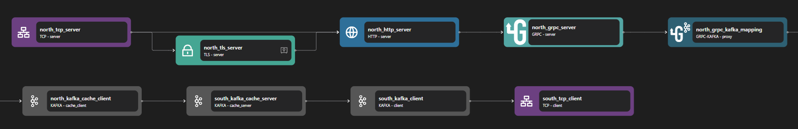

# gRPC Kafka Proxy

## Overview

The Zilla gRPC Kafka Proxy lets you implement gRPC service definitions from protobuf files to produce and consume messages via Kafka topics.

Zilla can be the gRPC server, routing a service method's request and response messages to and from Kafka topics, or Zilla can fanout messages from a Kafka topic to multiple gRPC clients using the [grpc-kafka](../../../reference/config/bindings/grpc-kafka/README.md) and [kafka-grpc](../../../reference/config/bindings/kafka-grpc/README.md) bindings in a [zilla.yaml](../../../reference/config/overview.md) config. Additionally, Zilla can sit on the critical path between a gRPC client and server. They can communicate as if they are talking directly to each other, while Zilla actually proxies the messages through Kafka.


## Key Capabilities

### gRPC-to-Kafka Mapping

Zilla supports all four [gRPC service method definitions](https://grpc.io/docs/what-is-grpc/core-concepts/#service-definition). Zilla enables seamless integration between gRPC services and Kafka by translating gRPC calls into Kafka messages. Each gRPC method maps to a specific Kafka topic, where:

- **Unary RPCs** translate to a request-response model using Kafka topics.
- **Server streaming RPCs** publish messages to a Kafka topic that clients can consume.
- **Client streaming RPCs** allow messages to be sent continuously to Kafka topics.
- **Bidirectional streaming RPCs** map to multiple Kafka topics for both sending and receiving messages.

### Correlated Request-Response

Zilla manages the synchronous request and response messages of a gRPC service. Request and response messages are correlated by a `zilla:correlation-id` header, providing an identifier for both Zilla and Kafka workflows to act on.

### gRPC Metadata

Zilla supports gRPC metadata, allowing additional context to be passed between gRPC clients and Kafka. This metadata is mapped to Kafka headers, ensuring that authentication and authorization details can be forwarded, custom headers in gRPC calls are preserved when transmitting through Kafka, and Kafka consumers can utilize metadata for processing messages appropriately.

### Message Filtering

Zilla provides message filtering capabilities, enabling selective consumption of Kafka messages based on specific criteria. This allows gRPC services to subscribe only to relevant messages, Kafka consumers to process specific message types efficiently, and enhanced performance by reducing unnecessary message delivery.

### Reliable Delivery

Clients can fetch some or all messages from a single Kafka topic using a route with the [fetch capability](../../../reference/config/bindings/grpc-kafka/README.md) by creating a service definition with an `Empty` request type and the topic message as the response type. Zilla sends an event ID with every message serialized as an unknown field in the payload. Messages can be identified without field collision, and the client doesn't need to acknowledge the message receipt explicitly. A client consuming the stream of messages can remember the event ID. In the event, the stream gets interrupted. The client can reconnect with a last-event-id header to recover without message loss or needing to start over from the beginning.

### Caching

Zilla supports caching to optimize performance and reduce redundant processing. This caching mechanism stores frequently requested data to minimize latency, reduces redundant Kafka queries by caching responses, and improves efficiency in high-load environments.

### Kafka Consumer Groups

The [kafka-grpc](../../../reference/config/bindings/kafka-grpc/README.md) `remote_server` binding will create a consumer group. It creates one consumer per named binding in a zilla config. The format of the consumer group ID is `zilla:<zilla namespace>-<binding name>`. Scaling the number of Zilla instances with the same configuration will add each new Zilla instance as a member of the same group. Using different Zilla `namespace`s or adding multiple bindings will create different consumer groups.

The [grpc-kakfa](../../../reference/config/bindings/grpc-kafka/README.md) does not create consumer groups. Instead, the binding fetches messages from a topic the same way for all connected clients. Clients can filter messages received using filters like adding the desired Kafka message key in the `idempotency-key` header. The client can track and recover progress through the stream using [reliable delivery](#reliable-delivery).

## Use Cases

### Real-Time Event Processing

Many applications require real-time event processing to handle continuous streams of data efficiently. Using gRPC with Kafka and Zilla enables seamless message exchange and event-driven processing, ensuring scalability and reliability in distributed systems. For example, a ride-hailing system [Taxi Demo](https://github.com/aklivity/zilla-demos/tree/main/taxi) can use this setup to manage ride updates, driver availability, and trip status changes efficiently. Using gRPC with Kafka and Zilla enables seamless message exchange and event-driven processing. Kafka acts as the message broker, ensuring scalability and reliability, while Zilla provides protocol mediation between gRPC services and Kafka topics. This setup allows real-time ride updates, driver availability, and trip status changes to be efficiently processed and distributed across different system components.

### High-Throughput Data Streaming

Many industries rely on high-throughput data streaming to process large volumes of information in real time. A gRPC-Kafka-Zilla architecture enables durable and scalable event distribution while facilitating seamless protocol translation. For example, financial market applications [Vortex Demo](https://github.com/aklivity/zilla-demos/tree/main/taxi) leverage this setup to ensure real-time market data distribution, order book updates, and analytics. The architecture enables high-throughput data streaming from financial data providers to consumers. Kafka ensures durability and scalability of market data streams, while Zilla facilitates protocol translation, enabling seamless gRPC communication. This architecture supports efficient market data distribution, order book updates, and real-time analytics.

## Examples



Access the gRPC Kafka example files here: [gRPC Kafka Repository](https://github.com/aklivity/zilla/tree/develop/examples/grpc.kafka.echo)

::: details Full gRPC kafka zilla.yaml Config

```yaml
name: example
catalogs:
  host_filesystem:
    type: filesystem
    options:
      subjects:
        echo:
          path: proto/echo.proto
vaults:
  my_servers:
    type: filesystem
    options:
      keys:
        store: tls/localhost.p12
        type: pkcs12
        password: ${{env.KEYSTORE_PASSWORD}}
bindings:
  north_tcp_server:
    type: tcp
    kind: server
    options:
      host: 0.0.0.0
      port:
        - 7151
        - 7153
    routes:
      - when:
          - port: 7151
        exit: north_http_server
      - when:
          - port: 7153
        exit: north_tls_server
  north_tls_server:
    type: tls
    kind: server
    vault: my_servers
    options:
      keys:
        - localhost
      sni:
        - localhost
      alpn:
        - h2
    exit: north_http_server
  north_http_server:
    type: http
    kind: server
    options:
      versions:
        - h2
      access-control:
        policy: cross-origin
    exit: north_grpc_server
  north_grpc_server:
    type: grpc
    kind: server
    catalog:
      host_filesystem:
        - subject: echo
    routes:
      - when:
          - method: grpc.examples.echo.Echo/*
        exit: north_grpc_kafka_mapping
  north_grpc_kafka_mapping:
    type: grpc-kafka
    kind: proxy
    routes:
      - when:
          - method: grpc.examples.echo.Echo/*
        exit: north_kafka_cache_client
        with:
          capability: produce
          topic: echo-messages
          acks: leader_only
          reply-to: echo-messages
  north_kafka_cache_client:
    type: kafka
    kind: cache_client
    exit: south_kafka_cache_server
  south_kafka_cache_server:
    type: kafka
    kind: cache_server
    options:
      bootstrap:
        - echo-messages
    exit: south_kafka_client
  south_kafka_client:
    type: kafka
    kind: client
    options:
      servers:
        - kafka:29092
    exit: south_tcp_client
  south_tcp_client:
    type: tcp
    kind: client
telemetry:
  exporters:
    stdout_logs_exporter:
      type: stdout
```

:::

The above configuration is an example of a gRPC Kafka proxy. It listens on https port 7153 and will exchange grpc messages in protobuf format through the echo-messages topic in Kafka.

The gRPC Kafka Proxy can be constructed with three parts: the gRPC server, the gRPC-Kafka adapter, and the Kafka client. When the gRPC server receives a request, the stream is passed into a gRPC-Kafka adapter and then converted into a Kafka request.

The gRPC server consists of the following bindings: TCP Server, TLS Server, HTTP Server, and gRPC server. A TCP Server is required to open a specific port and allows inbound connection. A TLS server is optional but can be used to perform TLS encryption for HTTPS. The data stream is then passed to an HTTP server, which is also passed to a gRPC server.

::: note
The gRPC server binding needs HTTP server bindings since gRPC is a protocol that runs over HTTP.
:::

The Kafka client consists of the following bindings: Kafka Cache Client, Kafka Cache Server, Kafka Client, and TCP Client. A TCP client is required to allow outbound TCP connections and a Kafka Client is used to connect to external Kafka services. Kafka Cache Client and Server are used for additional layers before direct connection to the Kafka client. These bindings add a caching layer and additional features to Kafka requests through Zilla.

The gRPC-Kafka adapter is used to convert gRPC-based requests into Kafka-based requests.

**Other Examples**:

- [grpc.kafka.fanout](https://github.com/aklivity/zilla/tree/develop/examples/grpc.kafka.fanout)
