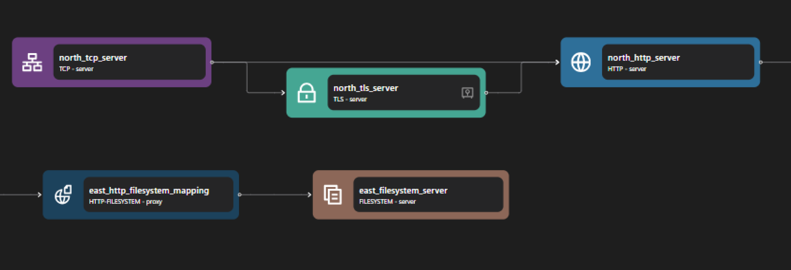

# HTTP Filesystem

## Overview

The HTTP Filesystem binding transforms Zilla into a versatile web server, enabling file serving and management directly from the filesystem. It’s ideal for scenarios requiring lightweight, configurable file hosting. This capability makes Zilla a powerful tool for developers who need to quickly set up a file-serving infrastructure without the overhead of more complex systems.


## Key Capabilities

### Configurable File Routing

Zilla supports file routing, enabling users to define specific paths for serving files and specific binding for specific paths. This routing includes specifying which operations (CREATE, READ, DELETE, UPDATE, etc) are allowed for certain endpoints. This flexibility ensures that files and directories can be organized and accessed in a manner that suits the application's needs. For example, you can only allow GET HTTP method for the endpoints so that the file server is read-only.

### Static File Serving

For simple use cases, Zilla can be used to serve static content across networks, whether it's static websites, images, and much more.

### Filesystem operations support

Zilla supports a wide range of basic filesystem operations, including:

- `CREATE_DIRECTORY`
- `CREATE_FILE`
- `DELETE_DIRECTORY`
- `DELETE_FILE`
- `READ_DIRECTORY`
- `READ_FILE`
- `READ_FILE_CHANGES`
- `READ_METADATA`
- `WRITE_FILE`

Other than that, it's also possible to specify a directory with a symbolic link in Zilla. This allows for more flexible file organization and can simplify the management of complex directory structures.

## Use Cases

### Simple CDN

Zilla can function as a simple Content Delivery Network (CDN), efficiently serving static assets to users. Its lightweight nature and configurable routing make it an excellent choice for small to medium-sized CDN implementations.

### File server

Zilla can be used as a straightforward file server, providing easy access to files stored on the local filesystem and capabilities for manipulating the directories and files. This is particularly useful for internal networks or development environments where quick and easy file-sharing management is needed. For example, it can be used to share project files among team members or to provide a simple interface for uploading and downloading files.

## Examples



Access the HTTP Filesystem example files here: [HTTP Filesystem Repository](https://github.com/aklivity/zilla/tree/develop/examples/http.filesystem)

::: details Full HTTP Filesystem zilla.yaml Config

```yaml
---
name: example
vaults:
  my_servers:
    type: filesystem
    options:
      keys:
        store: tls/localhost.p12
        type: pkcs12
        password: ${{env.KEYSTORE_PASSWORD}}
bindings:
  north_tcp_server:
    type: tcp
    kind: server
    options:
      host: 0.0.0.0
      port:
        - 7114
        - 7143
    routes:
        - when:
            - port: 7114
          exit: north_http_server
        - when:
            - port: 7143
          exit: north_tls_server
  north_tls_server:
    type: tls
    kind: server
    vault: my_servers
    options:
      keys:
        - localhost
      sni:
        - localhost
      alpn:
        - http/1.1
        - h2
    exit: north_http_server
  north_http_server:
    type: http
    kind: server
    routes:
      - when:
          - headers:
              :scheme: http
              :authority: localhost:7114
          - headers:
              :scheme: https
              :authority: localhost:7143
        exit: east_http_filesystem_mapping
  east_http_filesystem_mapping:
    type: http-filesystem
    kind: proxy
    routes:
      - when:
          - path: /{path}
        exit: east_filesystem_server
        with:
          path: ${params.path}
  east_filesystem_server:
    type: filesystem
    kind: server
    options:
      location: /var/www/
telemetry:
  exporters:
    stdout_logs_exporter:
      type: stdout
```

:::

The above configuration is an example of an HTTP filesystem, where port 7114 is used for HTTP traffic, and port 7143 is used for HTTPS traffic with TLS encryption.

The HTTP Filesystem consists of three main parts: the HTTP server, the HTTP-Filesystem proxy, and the Filesystem server. The configuration enables routing of HTTP requests from the HTTP server through an HTTP-Filesystem proxy, which maps requests to corresponding file paths and retrieves content from the Filesystem server.

The HTTP server consists of the following bindings: TCP Server, TLS Server, and HTTP Server. The TCP server opens a specific port to allow inbound connections, and the TLS server (if enabled) provides encryption for HTTPS traffic. Once a secure connection is established, the data stream is passed to the HTTP server, which processes the incoming HTTP requests and routes them to the appropriate destinations.

The HTTP-Filesystem proxy consists of the `http-filesystem` binding, which acts as an intermediary between the HTTP server and the filesystem server. It inspects incoming HTTP requests and maps them to corresponding filesystem paths. When a request is received, it extracts the path parameter and forwards it to the filesystem server, ensuring that files are served dynamically based on the requested URL structure.

The Filesystem server consists of the `filesystem` binding, which directly handles file storage and retrieval. It is configured to serve files from the `/var/www/` directory, making it the final destination for requests that pass through the HTTP-Filesystem proxy. When a request reaches this server, it resolves the requested path and returns the corresponding file, enabling static content delivery.
