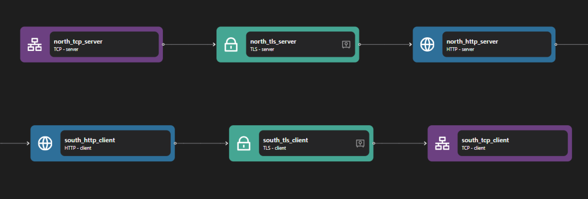

# HTTP Proxy

## Overview

Zilla’s HTTP proxy provides a secure and efficient solution for managing API requests. It offers advanced capabilities, including fine-grained CORS control, authorization enforcement through guards, dynamic request routing, and strict request validation. By implementing CORS policies, Zilla allows controlled access from different origins while maintaining strict security measures. Its authorization guards ensure that only authenticated users can interact with protected resources. The proxy's dynamic routing functionality enables intelligent traffic management by evaluating HTTP headers to determine the appropriate destination.


## Key Capabilities

### Cross-Origin Resource Sharing (CORS)

Zilla supports granular control over Cross-Origin Resource Sharing (CORS) by specifying an access control policy of `cross-origin`, allowing APIs to be accessed securely from different origins while preventing unauthorized `cross-origin` requests. Further configuration allows for finer-grained access control including specific request origins, methods and headers allowed, and specific response headers exposed.

### Authorization Through Guard Enforcement

Zilla implements a [guard](../../../reference/config/overview.html#guards) mechanism to enforce authorization rules before processing requests and the credentials can be extracted from a cookie, header or query parameter. This ensures that only authenticated and authorized users can access protected resources.

### Dynamic Routing Based on HTTP Requests

Zilla enables dynamic routing by evaluating HTTP request headers, directing application streams to the appropriate `exit` binding based on predefined conditions.

### Request Validation Enforcement

Zilla ensures that incoming requests comply with predefined schemas, enhancing security and data integrity by rejecting malformed or invalid data.

By utilizing these capabilities, Zilla’s HTTP proxy strengthens security, enhances flexibility, and ensures compliance in API management.

## Use Cases

### API Gateway

Organizations using a microservices architecture can leverage Zilla’s HTTP proxy to manage API traffic efficiently. It ensures secure communication between services by enforcing authentication, routing requests dynamically, and validating incoming data before passing it to backend services.

### Load Balancing and Traffic Routing

Zilla’s ability to route requests based on HTTP attributes allows it to function as a smart load balancer. Incoming requests can be directed to different backend services based on headers, query parameters, or user authentication status, optimizing performance and scalability.

## Examples



Access the HTTP Proxy example files here: [HTTP Proxy Repository](https://github.com/aklivity/zilla-examples/tree/main/grpc.kafka.echo)

::: details Full HTTP Proxy zilla.yaml Config

```yaml
---
name: example
vaults:
  your_clients:
    type: filesystem
    options:
      trust:
        store: tls/truststore.p12
        type: pkcs12
        password: ${{env.KEYSTORE_PASSWORD}}
  my_servers:
    type: filesystem
    options:
      keys:
        store: tls/localhost.p12
        type: pkcs12
        password: ${{env.KEYSTORE_PASSWORD}}
bindings:
  north_tcp_server:
    type: tcp
    kind: server
    options:
      host: 0.0.0.0
      port: 7143
    exit: north_tls_server
  north_tls_server:
    type: tls
    kind: server
    vault: my_servers
    options:
      keys:
        - localhost
      sni:
        - localhost
      alpn:
        - h2
    exit: north_http_server
  north_http_server:
    type: http
    kind: server
    options:
      access-control:
        policy: cross-origin
    routes:
      - when:
          - headers:
              :scheme: https
              :authority: localhost:7143
              :path: /*
        exit: south_http_client
  south_http_client:
    type: http
    kind: client
    exit: south_tls_client
  south_tls_client:
    type: tls
    kind: client
    vault: your_clients
    options:
      trustcacerts: true
      trust:
        - nginx
      sni:
        - nginx
      alpn:
        - h2
    exit: south_tcp_client
  south_tcp_client:
    type: tcp
    kind: client
    options:
      host: nginx
      port: 443
telemetry:
  exporters:
    stdout_logs_exporter:
      type: stdout
```

:::

The above configuration is an example of an HTTP proxy. It listens on HTTPS port 7143 and forwards traffic to an external service on TCP port 443.

The HTTP Proxy consists of two main parts: the HTTP server and the HTTP client. When the HTTP server receives a request, it creates an HTTP request to external services through the HTTP client based on the routing configuration and returns the response.

The HTTP server consists of the following bindings: TCP Server, TLS Server, and HTTP Server. The TCP Server opens port 7143 and allows inbound TCP connections. Once a connection is established, the data stream is passed to the TLS Server, where TLS encryption is applied, enabling secure HTTPS communication. The encrypted data is then forwarded to the HTTP Server that processes HTTP requests and applies routing rules.

The HTTP client consists of the following bindings: HTTP Client, TLS Client, and TCP Client. The HTTP Client is responsible for forwarding the HTTP request to the external service. If encryption is required, the TLS Client ensures that the outgoing request is secured before sending it over the network. Finally, the TCP Client establishes a connection to the target server on port 443, where the request is delivered, and the response follows the same path back to the original requester.

**Other Examples**:

- [http.proxy.schema.inline](https://github.com/aklivity/zilla-examples/tree/main/http.proxy.schema.inline)
