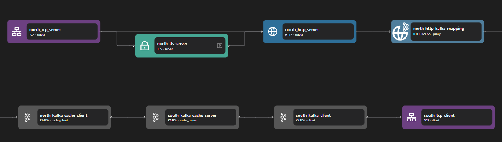

# HTTP Kafka Proxy

## Overview

The Zilla HTTP Kafka Proxy lets you configure application-centric REST APIs and SSE streams that unlock Kafka event-driven architectures.

A developer has the freedom to define their own HTTP mapping to Kafka, with control over the topics, message key, message headers, and payload. Any HTTP client can interact with Kafka without navigating Kafka-specific paradigms.

## Key Capabilities

### Configurable Endpoints

Zilla can map REST APIs to Kafka using the [http-kafka](../../../reference/config/bindings/http-kafka/README.md) binding in a [zilla.yaml](../../../reference/config/overview.md) config. Zilla routes REST urls using wildcard pattern matching and dynamic path params. Dynamic path matching and custom message routing from endpoints to Kafka topics help prevent API lock-in.

Zilla groups HTTP methods into two capabilities:

- **Produce**: Handles `POST`, `PUT`, `DELETE`, and `PATCH` to send messages to Kafka.
- **Fetch**: Uses `GET` to retrieve messages from Kafka.

For asynchronous operations, a `PUT` request submits data, and a `GET` request retrieves the response from the provided async location.

### Correlated Request-Response

Zilla handles HTTP requests and responses using Kafka topics, linking them with a `zilla:correlation-id` header.

- **Synchronous (sync)**: The client sends a request, and the server waits for the corresponding response message before replying.
- **Asynchronous (async)**: The client includes a `prefer: respond-async` header, gets a `202 Accepted` response with a location path, and later sends a GET request with `prefer: wait=N` to retrieve the response once it's available, avoiding constant polling.

### Message Filtering

Zilla allows HTTP clients to filter Kafka messages based on criteria such as message keys and headers. When an HTTP request is sent, filters can be applied at the request level to ensure only relevant Kafka messages are retrieved. This improves efficiency by reducing unnecessary data transfer and processing.

### Oneway Messaging

Zilla supports oneway messaging for scenarios where a response is unnecessary. Clients can send messages to Kafka topics without awaiting a response, suitable for fire-and-forget use cases. The Kafka message key and headers are set using path params.

### Idempotency

Requests can be idempotent (to make multiple identical requests and receive the same response every time) by including an `idempotency-key` header. Zilla will use the `idempotency-key` and `zilla:correlation-id` headers to identify and return the same message fetched from the response topic without producing a second message to the request topic. Each new `idempotency-key` used will produce a message with "at least once" delivery. A second message will be produced if the same request is made in the short window before a correlated response is added to the response topic. A Kafka consumer can detect and ignore any potential duplicate requests because they will have the same `idempotency-key` and `zilla:correlation-id`.

### Caching

Bindings can retrieve messages from a Kafka topic, filtered by message key and headers, with the key and header values extracted from the path params.

An HTTP response returns with an [ETag](https://developer.mozilla.org/en-US/docs/Web/HTTP/Headers/ETag) header. This fetch supports a conditional [if-none-match](https://developer.mozilla.org/en-US/docs/Web/HTTP/Headers/If-None-Match) request, returning `304` if not modified or `200` if modified (with a new ETag header). A client can wait for a modified response by including `prefer:wait=N` and `cache-control: no-cache` headers. The request will wait for up to `N` seconds and return once a message with a new ETag header is delivered on the response topic.

### CORS Support

Zilla supports Cross-Origin Resource Sharing (CORS) and allows you to specify fine-grained access control, including specific request origins, methods and headers allowed, and specific response headers exposed. Since it acts more like a guard and has no dependency on Apache Kafka configuration, you need to define it in the [http](../../../reference/config/bindings/http/README.md) binding.

### Authorization

Zilla has a modular config that includes the concept of a [Guard](../../security/guard.md#guard) where you define your `guard` configuration and reference that `guard` to authorize a specific endpoint. JSON Web Token (JWT) authorization is supported with the [`jwt`](../../security/guard/jwt.md#jwt) Guard.

## Use Cases

### Simplifying REST API Integration with Kafka

Many applications rely on REST APIs but need real-time data streaming. An HTTP Kafka Proxy enables seamless integration, allowing services to transition from REST to event-driven communication without significant architectural changes. One example of this is the [REST API Integration with Kafka tutorial](../../../tutorials/rest/rest-intro.md#crud-api-on-kafka), which demonstrates how to expose Kafka topics over REST, making it easier for applications to produce and consume messages without Kafka-specific clients.

### Event-Driven Web Applications

Web applications often require real-time event updates, such as notifications or live dashboards. By using an HTTP Kafka Proxy, these apps can send events via `POST` and consume them via `GET` or **Server-Sent Events (SSE)**, making real-time updates simpler. A great example is the [CQRS with Kafka and REST project](https://github.com/aklivity/zilla-demos/tree/main/todo-mvc-cqrs), which showcases how Kafka can be used in a CQRS (Command Query Responsibility Segregation) pattern with a REST-based frontend.

## Examples



Access the HTTP Kafka example files here: [HTTP Kafka CRUD Repository](https://github.com/aklivity/zilla-examples/tree/main/http.kafka.crud)

::: details Full HTTP Kafka CRUD zilla.yaml Config

```yaml
---
name: example
vaults:
  my_servers:
    type: filesystem
    options:
      keys:
        store: tls/localhost.p12
        type: pkcs12
        password: ${{env.KEYSTORE_PASSWORD}}
bindings:
  north_tcp_server:
    type: tcp
    kind: server
    options:
      host: 0.0.0.0
      port:
        - 7143
        - 7114
    routes:
      - when:
          - port: 7143
        exit: north_tls_server
      - when:
          - port: 7114
        exit: north_http_server
  north_tls_server:
    type: tls
    kind: server
    vault: my_servers
    options:
      keys:
        - localhost
      sni:
        - localhost
      alpn:
        - http/1.1
        - h2
    exit: north_http_server
  north_http_server:
    type: http
    kind: server
    routes:
      - when:
          - headers:
              :scheme: http
              :authority: localhost:7114
          - headers:
              :scheme: https
              :authority: localhost:7143
        exit: north_http_kafka_mapping
  north_http_kafka_mapping:
    type: http-kafka
    kind: proxy
    routes:
      - when:
          - method: POST
            path: /items
        exit: north_kafka_cache_client
        with:
          capability: produce
          topic: items-snapshots
          key: ${idempotencyKey}
      - when:
          - method: PUT
            path: /items/{id}
        exit: north_kafka_cache_client
        with:
          capability: produce
          topic: items-snapshots
          key: ${params.id}
      - when:
          - method: DELETE
            path: /items/{id}
        exit: north_kafka_cache_client
        with:
          capability: produce
          topic: items-snapshots
          key: ${params.id}
      - when:
          - method: GET
            path: /items
        exit: north_kafka_cache_client
        with:
          capability: fetch
          topic: items-snapshots
          merge:
            content-type: application/json
      - when:
          - method: GET
            path: /items/{id}
        exit: north_kafka_cache_client
        with:
          capability: fetch
          topic: items-snapshots
          filters:
            - key: ${params.id}
  north_kafka_cache_client:
    type: kafka
    kind: cache_client
    exit: south_kafka_cache_server
  south_kafka_cache_server:
    type: kafka
    kind: cache_server
    options:
      bootstrap:
        - items-snapshots
    exit: south_kafka_client
  south_kafka_client:
    type: kafka
    kind: client
    options:
      servers:
        - kafka:29092
    exit: south_tcp_client
  south_tcp_client:
    type: tcp
    kind: client
telemetry:
  exporters:
    stdout_logs_exporter:
      type: stdout
```

:::

The above configuration represents an HTTP-Kafka proxy, facilitating the exchange of HTTP requests and responses through Kafka messaging. It listens on port 7143 for HTTPS traffic, port 7114 for HTTP traffic, and port 29092 for Kafka communication.

The HTTP-Kafka proxy consists of three main components: the HTTP server, the HTTP-Kafka adapter, and the Kafka client. When an HTTP request is received, the data stream is processed through a structured pipeline that ensures secure communication, efficient message routing, and optimized caching before reaching Kafka.

The HTTP server consists of the following bindings: TCP Server, TLS Server, and HTTP Server. The TCP server opens a specific port to allow inbound connections, and the TLS server (if enabled) provides encryption for HTTPS traffic. Once a secure connection is established, the data stream is passed to the HTTP server, which processes the incoming HTTP requests and routes them to the appropriate destinations.

The HTTP-Kafka adapter acts as a bridge between HTTP-based communication and Kafka messaging. It maps HTTP requests to Kafka topics, enabling seamless message transformation. Incoming HTTP requests are categorized based on their method (e.g., `GET`, `POST`, `PUT`, `DELETE`) and routed accordingly. This adapter ensures that the correct Kafka topics are used for different types of operations, maintaining a structured flow of messages.

The Kafka client consists of several components: Kafka Cache Client, Kafka Cache Server, and Kafka Client. The Kafka Cache Client interacts with the cache layer to optimize message retrieval and prevent redundant queries. The Kafka Cache Server stores intermediate Kafka messages before passing them to the Kafka Client. The Kafka Client connects directly to external Kafka services, ensuring that messages are correctly published and consumed, with the TCP Client handling the underlying network communication to Kafka brokers.

This proxy enables CRUD (Create, Read, Update, Delete) operations through HTTP requests mapped to Kafka messages.

- `POST /items` creates new items by sending messages to the items-snapshots topic.
- `PUT /items/{id}` updates an existing item by modifying the relevant Kafka message.
- `DELETE /items/{id}` removes an item by sending a delete request to Kafka.
- `GET /items` retrieves all items by fetching data from the Kafka cache.
- `GET /items/{id}` retrieves a specific item by filtering messages based on its key.

**Other Examples**:

- [http.kafka.async](https://github.com/aklivity/zilla-examples/tree/main/http.kafka.async)
- [http.kafka.cache](https://github.com/aklivity/zilla-examples/tree/main/http.kafka.cache)
- [http.kafka.oneway](https://github.com/aklivity/zilla-examples/tree/main/http.kafka.oneway)
- [http.kafka.sync](https://github.com/aklivity/zilla-examples/tree/main/http.kafka.sync)
