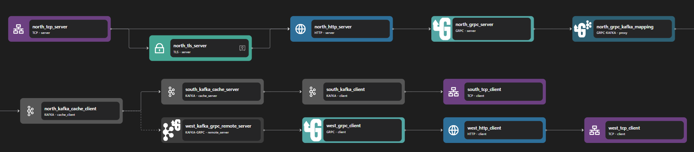

# Kafka gRPC

## Overview

Zilla's [Kafka gRPC binding](../../../reference/config/bindings/kafka-grpc/README.md) acts as a bridge between Kafka streams and gRPC-based services, enabling seamless integration between event-driven messaging and request-response interactions. This binding is ideal for scenarios where Kafka topics need to communicate with remote gRPC services, such as microservices or external APIs, ensuring reliable message delivery, request correlation, and idempotent processing.


## Key Capabilities

### Receiving and Processing

In the `kafka-grpc` binding, gRPC requests are received as **messages** from a designated Kafka `topic` (e.g., `requests`). These messages are then processed and forwarded to the appropriate gRPC service. Once the gRPC service generates a **response**, the result is published back to a response Kafka topic (e.g., `responses`), ensuring a complete request-response cycle.

### Correlation IDs

To maintain the connection between a request and its corresponding response, `kafka-grpc` uses **correlation IDs**. A unique identifier, typically stored in the `zilla:correlation-id` header, is attached to each incoming request. When the response is generated, it retains the same correlation ID, allowing consumers to match responses to their original requests accurately.

### Idempotency Key

To ensure reliability in message processing, `kafka-grpc` supports an **idempotency key**, which prevents duplicate request execution. The key, often stored in a metadata field like `idempotency-key`, helps track whether a request has already been processed, reducing the risk of unintended duplicate actions in distributed systems.

## Use Cases

### Proxy Kafka Stream to External APIs

Zilla’s Kafka gRPC binding enables Kafka topics to act as a proxy for external gRPC APIs. This is useful when integrating event-driven applications with third-party services that rely on gRPC for communication. Instead of directly invoking APIs, messages published to a Kafka topic can be automatically forwarded to remote gRPC endpoints, ensuring decoupled and scalable interactions.

### Event-Driven Workflows

By bridging Kafka with gRPC services, this binding allows event-driven architectures to interact with gRPC-based microservices seamlessly. For example, business events such as user sign-ups, order placements, or status updates can be processed in Kafka and then dispatched to gRPC services for further processing. This ensures asynchronous, scalable, and resilient workflows in distributed systems.

## Examples



Access the Kafka gRPC Proxy example files here: [Kafka gRPC Proxy Repository](https://github.com/aklivity/zilla-examples/tree/main/grpc.kafka.proxy)

::: details Full Kafka gRPC Proxy zilla.yaml Config

```yaml
---
name: example
catalogs:
  host_filesystem:
    type: filesystem
    options:
      subjects:
        echo:
          path: proto/echo.proto
vaults:
  my_servers:
    type: filesystem
    options:
      keys:
        store: tls/localhost.p12
        type: pkcs12
        password: ${{env.KEYSTORE_PASSWORD}}
bindings:
  north_tcp_server:
    type: tcp
    kind: server
    options:
      host: 0.0.0.0
      port:
        - 7151
        - 7153
    routes:
      - when:
          - port: 7151
        exit: north_http_server
      - when:
          - port: 7153
        exit: north_tls_server
  north_tls_server:
    type: tls
    kind: server
    vault: my_servers
    options:
      keys:
        - localhost
      sni:
        - localhost
      alpn:
        - h2
    exit: north_http_server
  north_http_server:
    type: http
    kind: server
    options:
      versions:
        - h2
      access-control:
        policy: cross-origin
    exit: north_grpc_server
  north_grpc_server:
    type: grpc
    kind: server
    catalog:
      host_filesystem:
        - subject: echo
    routes:
      - when:
          - method: grpc.examples.echo.Echo/*
        exit: north_grpc_kafka_mapping
  north_grpc_kafka_mapping:
    type: grpc-kafka
    kind: proxy
    routes:
      - when:
          - method: grpc.examples.echo.Echo/*
        exit: north_kafka_cache_client
        with:
          capability: produce
          topic: echo-requests
          acks: leader_only
          reply-to: echo-responses
  north_kafka_cache_client:
    type: kafka
    kind: cache_client
    exit: south_kafka_cache_server
  south_kafka_cache_server:
    type: kafka
    kind: cache_server
    exit: south_kafka_client
  south_kafka_client:
    type: kafka
    kind: client
    options:
      servers:
        - kafka:29092
    exit: south_tcp_client
  south_tcp_client:
    type: tcp
    kind: client
  west_kafka_grpc_remote_server:
    type: kafka-grpc
    kind: remote_server
    entry: north_kafka_cache_client
    options:
      acks: leader_only
    routes:
      - exit: west_grpc_client
        when:
          - topic: echo-requests
            reply-to: echo-responses
            method: grpc.examples.echo.Echo/*
        with:
          scheme: http
          authority: ${{env.ECHO_SERVER_HOST}}:${{env.ECHO_SERVER_PORT}}
  west_grpc_client:
    type: grpc
    kind: client
    routes:
      - exit: west_http_client
        when:
          - method: grpc.examples.echo.Echo/*
  west_http_client:
    type: http
    kind: client
    options:
      versions:
        - h2
    exit: west_tcp_client
  west_tcp_client:
    type: tcp
    kind: client
    options:
      host: ${{env.ECHO_SERVER_HOST}}
      port: ${{env.ECHO_SERVER_PORT}}
telemetry:
  exporters:
    stdout_logs_exporter:
      type: stdout
```

:::

The above configuration is an example of a Kafka-gRPC proxy. It listens on https port 7153 and uses Kafka as a proxy to talk to grpc-echo on TCP port 50051.

The Kafka gRPC proxy can be constructed with four parts: the gRPC server, the gRPC client, the gRPC-Kafka adapter, and the Kafka client. When a gRPC request is made, it will publish the request into a Kafka request topic and will be picked up and made into a gRPC request to an external gRPC service. The response is then stored in a Kafka response topic.

The gRPC server consists of the following bindings: TCP Server, TLS Server, HTTP Server, and gRPC server. A TCP Server is required to open a specific port and allows inbound connection. A TLS server is optional but can be used to perform TLS encryption for HTTPS. The data stream is then passed to an HTTP server, which is also passed to a gRPC server.

The gRPC client consists of the following bindings: gRPC client, HTTP client, TLS client, and TCP client. A TCP client is required to allow outbound TCP connections. A TLS client is optional but can be used to encrypt connections to outbound connections. A gRPC client is used to perform a gRPC request, which is then passed into an HTTP client.

::: note
The gRPC server/ client binding needs HTTP server/ client bindings since gRPC is a protocol that runs over HTTP.
:::

The Kafka client consists of the following bindings: Kafka Cache Client, Kafka Cache Server, Kafka Client, and TCP Client. A TCP client is required to allow outbound TCP connections and a Kafka Client is used to connect to external Kafka services. Kafka Cache Client and Server are used for additional layers before direct connection to the Kafka client. These bindings add a caching layer and additional features to Kafka requests through Zilla.

The gRPC-Kafka adapter is used to convert gRPC-based requests into Kafka-based requests.
