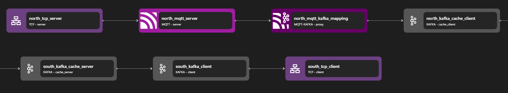

# MQTT Kafka Proxy

## Overview

The Zilla MQTT Kafka Proxy manages MQTT Pub/Sub connections and messages on and off of Kafka.

An MQTT server acts as a broker between publishers and subscribers. This requires a complex protocol to manage the wide range of IoT devices and use cases. By proxying these messages on and off of Kafka with the [mqtt-kafka](../../../reference/config/bindings/mqtt-kafka/README.md) binding in a [zilla.yaml](../../../reference/config/zilla-cli.md) config, IoT devices can transmit data to a wider range of tech stacks, adapting to more business needs.

Zilla uses specific Kafka topics to store and route MQTT messages, meaning the Kafka architecture can be optimized for MQTT Pub/Sub. MQTT client subscribers and publishers will communicate with Zilla the same as any broker.


## Key Capabilities

### Pub/Sub with Kafka

Zilla manages MQTT publish-subscribe (pub/sub) operations using Kafka, ensuring seamless message flow between MQTT clients and Kafka topics. It utilizes three Kafka topics to handle different aspects of MQTT communication, allowing for efficient data streaming and event-driven processing. The specific topic names can be configured using the [options.topics](../../../reference/config/bindings/mqtt-kafka/proxy.md) property.

### Messages on Kafka

All MQTT [messages](../../../reference/config/bindings/mqtt-kafka/proxy.md) brokered by Zilla are published to a designated Kafka topic. The MQTT message topic is mapped as the Kafka key, enabling efficient lookup, partitioning, and message distribution. This structure ensures that messages are stored reliably and can be consumed by Kafka clients in real time.

### Topic Routing

Zilla provides configurable [routes](../../../reference/config/bindings/mqtt-kafka/proxy.md) to direct MQTT publish and subscribe operations to specific Kafka topics beyond the default `message` topic. This flexibility allows for efficient message organization while ensuring that `session` and `retained` topics remain unaffected by routing changes.

### Retaining Messages

MQTT clients can publish messages with a retain flag, which ensures that a copy is stored in a dedicated `retained` Kafka topic. When a new subscriber joins and requests a replay-on-subscribe, Zilla delivers the retained messages from Kafka, providing a consistent experience for late-joining clients.

### Session Management

Client connection states, including MQTT connect, disconnect, and subscription details, are tracked in a log-compacted Kafka topic dedicated to `sessions`. Each MQTT client ID is used as a key, ensuring that session information is preserved across reconnects and enabling stateful interactions.

### Kafka Consumer Groups for MQTT Sessions

Zilla assigns a dedicated Kafka consumer group to each MQTT client session, following a structured naming format: `zilla:<zilla namespace>-<binding name>-<MQTT client ID>`. This approach optimizes session tracking while minimizing heartbeat traffic. If a client disconnects and does not reconnect within the session expiry interval, Zilla automatically cleans up the corresponding consumer group and session state in Kafka.

## Use Cases

### Bridging MQTT and Modern Applications

Many IoT and messaging-based systems use MQTT for lightweight, efficient communication. However, integrating MQTT with modern applications that rely on different protocols can be complex. An MQTT broker or gateway helps bridge this gap, enabling seamless communication between MQTT devices and other services.

### Real-Time Data Streaming for IoT

IoT devices frequently generate real-time data that needs to be processed and distributed efficiently. By leveraging MQTT, applications can subscribe to device events, process them, and trigger actions with minimal latency. The [Taxi demo](https://github.com/aklivity/zilla-demos/tree/main/taxi) illustrates this by using MQTT to stream live location updates from vehicles, enabling real-time tracking and event handling.

## Examples



Access the MQTT Kafka example files here: [MQTT Kafka Repository](https://github.com/aklivity/zilla-examples/tree/main/mqtt.kafka.broker.jwt)

::: details Full MQTT kafka zilla.yaml Config

```yaml
---
name: example
vaults:
  my_servers:
    type: filesystem
    options:
      keys:
        store: tls/localhost.p12
        type: pkcs12
        password: ${{env.KEYSTORE_PASSWORD}}
guards:
  authn_jwt:
    type: jwt
    options:
      issuer: https://auth.example.com
      audience: https://api.example.com
      keys:
        - kty: RSA
          n: qqEu50hX+43Bx4W1UYWnAVKwFm+vDbP0kuIOSLVNa+HKQdHTf+3Sei5UCnkskn796izA29D0DdCy3ET9oaKRHIJyKbqFl0rv6f516QzOoXKC6N01sXBHBE/ovs0wwDvlaW+gFGPgkzdcfUlyrWLDnLV7LcuQymhTND2uH0oR3wJnNENN/OFgM1KGPPDOe19YsIKdLqARgxrhZVsh06OurEviZTXOBFI5r+yac7haDwOQhLHXNv+Y9MNvxs5QLWPFIM3bNUWfYrJnLrs4hGJS+y/KDM9Si+HL30QAFXy4YNO33J8DHjZ7ddG5n8/FqplOKvRtUgjcKWlxoGY4VdVaDQ==
          e: AQAB
          alg: RS256
          kid: example
bindings:
  north_tcp_server:
    type: tcp
    kind: server
    options:
      host: 0.0.0.0
      port:
        - 7183
        - 7883
    routes:
        - when:
            - port: 7183
          exit: north_mqtt_server
        - when:
            - port: 7883
          exit: north_tls_server
  north_tls_server:
    type: tls
    kind: server
    vault: my_servers
    options:
      keys:
        - localhost
      sni:
        - localhost
    exit: north_mqtt_server
  north_mqtt_server:
    type: mqtt
    kind: server
    options:
      authorization:
        authn_jwt:
          credentials:
            connect:
              username: Bearer {credentials}
    routes:
      - guarded:
          authn_jwt:
            - mqtt:stream
        exit: north_mqtt_kafka_mapping
  north_mqtt_kafka_mapping:
    type: mqtt-kafka
    kind: proxy
    options:
      topics:
        sessions: mqtt-sessions
        messages: mqtt-messages
        retained: mqtt-retained
    exit: north_kafka_cache_client
  north_kafka_cache_client:
    type: kafka
    kind: cache_client
    exit: south_kafka_cache_server
  south_kafka_cache_server:
    type: kafka
    kind: cache_server
    options:
      bootstrap:
        - mqtt-messages
        - mqtt-retained
    exit: south_kafka_client
  south_kafka_client:
    type: kafka
    kind: client
    options:
      servers:
        - kafka:29092
    exit: south_tcp_client
  south_tcp_client:
    type: tcp
    kind: client
telemetry:
  exporters:
    stdout_logs_exporter:
      type: stdout
```

:::

The above configuration is an example of an MQTT Kafka. It listens on mqtt port 7183 and mqtts port 7883 and will forward mqtt publish messages from an authorized mqtt client to Kafka, delivering to all authorized mqtt clients subscribed to the same topic.

The MQTT Kafka Proxy can be constructed with three parts: the MQTT server, the MQTT-Kafka adapter, and the Kafka client. When the MQTT server receives a request, the stream is passed into an MQTT-Kafka adapter and then converted into a Kafka request.

The MQTT server consists of the following bindings: TCP Server, TLS Server, and MQTT server. A TCP Server is required to open a specific port and allow inbound connections. A TLS server is optional but can be used to perform TLS encryption for MQTTS. The data stream is then passed to the MQTT server.

The Kafka client consists of the following bindings: Kafka Cache Client, Kafka Cache Server, Kafka Client, and TCP Client. A TCP client is required to allow outbound TCP connections and a Kafka Client is used to connect to external Kafka services. Kafka Cache Client and Server are used for additional layers before direct connection to the Kafka client. These bindings add a caching layer and additional features to Kafka requests through Zilla.

The MQTT-Kafka adapter is used to convert MQTT-based requests into Kafka-based requests.

**Other Examples**:

- [mqtt.kafka.broker](https://github.com/aklivity/zilla-examples/tree/main/mqtt.kafka.broker)
- [asyncapi.mqtt.kafka.proxy](https://github.com/aklivity/zilla-examples/tree/main/asyncapi.mqtt.kafka.proxy)
- [asyncapi.mqtt.proxy](https://github.com/aklivity/zilla-examples/tree/main/asyncapi.mqtt.proxy)
