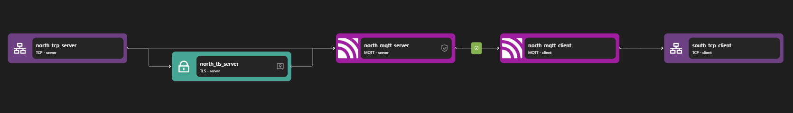

# MQTT Proxy

Zilla’s MQTT proxy provides a robust and scalable solution for managing MQTT message flows. It enables efficient publish-subscribe communication while enforcing secure authentication, advanced message routing, and schema validation. With support for JWT-based authentication, Zilla ensures that only authorized clients can connect and interact with the broker. Its dynamic topic-based routing optimizes message distribution, enhancing performance and scalability. Schema validation guarantees data integrity by ensuring that all messages conform to predefined structures. Additionally, Zilla integrates seamlessly with AsyncAPI specifications, allowing for standardized and declarative configuration of MQTT interactions in event-driven architectures.


## Key Capabilities

### Publish-Subscribe Model

Zilla's MQTT Proxy facilitates a publish-subscribe (Pub/Sub) messaging architecture, enabling clients to publish messages to topics and receive updates from subscribed topics. This ensures efficient, event-driven communication across distributed systems.

### Advanced Message Routing

Zilla supports topic-based routing, dynamically directing MQTT messages to appropriate destinations based on predefined rules. This enables optimized message distribution, ensuring scalability and efficient resource utilization.

### Secure Authentication Enforcement

Zilla implements authentication validation using JWT-based security mechanisms, ensuring only authorized clients can connect to the MQTT broker. By leveraging [JWT guard](../../../reference/config/guards/jwt.md), organizations can enforce secure access control and prevent unauthorized interactions.

### Schema Validation for Data Integrity

With schema validation, Zilla ensures that MQTT messages conform to predefined data structures before processing, preventing malformed payloads and enhancing data integrity. This is achieved through Zilla’s configurable [catalog-based schema validation](../../../reference/config/catalogs/), providing a reliable mechanism for structured message exchanges.

### Seamless AsyncAPI Integration

Zilla supports loading configurations from AsyncAPI specifications, enabling a declarative approach to defining MQTT topics, message formats, and interactions. By utilizing [Zilla’s AsyncAPI bindings](../../../reference/config/bindings/asyncapi/README.md), organizations can standardize API definitions and streamline integration with event-driven architectures.

## Use Cases

### Routing IoT Traffic Across Multiple MQTT Brokers

A smart factory deploys thousands of IoT devices that need to communicate with different MQTT brokers based on location or function. Zilla’s MQTT proxy enables dynamic traffic routing, ensuring each device connects to the appropriate broker without manual configuration. Authentication enforcement prevents unauthorized access, while schema validation ensures data integrity before messages are processed.

### Multi-Tenant MQTT Proxy for SaaS Platforms

A cloud-based IoT platform serves multiple enterprises, each requiring isolated MQTT communication. Zilla’s MQTT proxy enables multi-tenant routing, directing MQTT connections to dedicated brokers based on tenant identity. JWT authentication secures access, while AsyncAPI integration ensures standardized message formats, enabling seamless communication across different tenant environments.

## Examples



Access the MQTT Proxy example files here: [MQTT Proxy Repository](https://github.com/aklivity/zilla-examples/tree/main/mqtt.proxy.jwt)

::: details Full MQTT Proxy zilla.yaml Config

```yaml
---
name: zilla-mqtt-proxy-jwt
vaults:
  my_servers:
    type: filesystem
    options:
      keys:
        store: tls/localhost.p12
        type: pkcs12
        password: ${{env.KEYSTORE_PASSWORD}}
guards:
  authn_jwt:
    type: jwt
    options:
      issuer: https://auth.example.com
      audience: https://api.example.com
      keys:
        - kty: RSA
          n: qqEu50hX+43Bx4W1UYWnAVKwFm+vDbP0kuIOSLVNa+HKQdHTf+3Sei5UCnkskn796izA29D0DdCy3ET9oaKRHIJyKbqFl0rv6f516QzOoXKC6N01sXBHBE/ovs0wwDvlaW+gFGPgkzdcfUlyrWLDnLV7LcuQymhTND2uH0oR3wJnNENN/OFgM1KGPPDOe19YsIKdLqARgxrhZVsh06OurEviZTXOBFI5r+yac7haDwOQhLHXNv+Y9MNvxs5QLWPFIM3bNUWfYrJnLrs4hGJS+y/KDM9Si+HL30QAFXy4YNO33J8DHjZ7ddG5n8/FqplOKvRtUgjcKWlxoGY4VdVaDQ==
          e: AQAB
          alg: RS256
          kid: example
bindings:
  north_tcp_server:
    type: tcp
    kind: server
    options:
      host: 0.0.0.0
      port:
        - 7183
        - 7883
    routes:
        - when:
            - port: 7183
          exit: north_mqtt_server
        - when:
            - port: 7883
          exit: north_tls_server
  north_tls_server:
    type: tls
    kind: server
    vault: my_servers
    options:
      keys:
        - localhost
      sni:
        - localhost
    exit: north_mqtt_server
  north_mqtt_server:
    type: mqtt
    kind: server
    options:
      authorization:
        authn_jwt:
          credentials:
            connect:
              username: Bearer {credentials}
    routes:
      - guarded:
          authn_jwt:
            - mqtt:stream
        exit: north_mqtt_client
  north_mqtt_client:
    type: mqtt
    kind: client
    exit: south_tcp_client
  south_tcp_client:
    type: tcp
    kind: client
    options:
      host: ${{env.MOSQUITTO_BROKER_HOST}}
      port: ${{env.MOSQUITTO_BROKER_PORT}}
telemetry:
  exporters:
    stdout_logs_exporter:
      type: stdout
```

:::

The above configuration is an example of an MQTT proxy. It listens on port 7183 and forwards MQTT publish messages to mosquito MQTT broker listening on 1883.

The MQTT Proxy consists of two main parts: the MQTT server and the MQTT client. When the MQTT server receives a stream, it creates an MQTT stream to external services through the MQTT client based on the routing configuration and returns the response.

The MQTT server consists of the following bindings: TCP Server, TLS Server, and MQTT Server. The TCP Server opens port 7183 and allows inbound TCP connections. Once a connection is established, the data stream is passed to the TLS Server, where TLS encryption is applied, enabling encrypted communication. The encrypted data is then forwarded to the MQTT Server, which processes MQTT requests and applies routing rules.

The MQTT client consists of the following bindings: MQTT Client, TLS Client (optional), and TCP Client. The MQTT Client is responsible for forwarding the MQTT request to the external MQTT service. If encryption is required, the TLS Client ensures the outgoing request is secured before sending it over the network. Finally, the TCP Client establishes a connection to the target server, where the request is delivered, and the response follows the same path back to the original requester.
