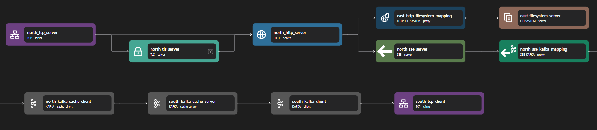

# SSE Kafka Proxy

## Overview

Zilla's [SSE-Kafka Proxy](../../../reference/config/bindings/sse-kafka/README.md) provides a seamless binding between Server-Sent Events (SSE) and Kafka, enabling SSE APIs to interact with Kafka’s event-driven architecture. It simplifies integration by allowing SSE clients to consume Kafka messages over HTTP, ensuring efficient real-time streaming with reliability, scalability, and flexible message filtering.


## Key Capabilities

### Protocol Adaptation

The [SSE-Kafka Proxy](../../../reference/config/bindings/sse-kafka/README.md) facilitates seamless integration between **Server-Sent Events (SSE)** and **Kafka**. It enables the adaptation of SSE data streams into Kafka data streams, allowing Kafka `messages` to be delivered to SSE clients over standard HTTP connections.

### Message Filtering

The proxy supports filtering Kafka messages based on **message keys**, **headers**, or a **combination of both**. This feature ensures that clients receive only relevant data, optimizing network usage and enhancing performance by reducing unnecessary data transmission.

### Reliable Delivery

Progress across Kafka topic partitions is conveyed to the SSE client via event `id`. When the stream is interrupted due to an SSE client reconnect, the `last-event-id` header in the reconnect request contains the last received event ID. This enables the SSE stream to resume seamlessly, ensuring no messages are lost and maintaining continuous data delivery.

### Caching

The proxy can be configured to cache recent Kafka messages, enhancing efficiency and reducing the load on Kafka brokers. This allows clients that reconnect or subscribe late to access historical data without repeatedly querying Kafka.

### Tombstone Message Handling

When the SSE-Kafka binding receives a Kafka tombstone (`null` value) message, it sends a `delete` event to the SSE client. The client can identify which message was deleted by referencing the message key from the SSE `delete` event `id`, ensuring accurate data synchronization.

### AsyncAPI Integration

The SSE-Kafka Proxy supports integration with the [AsyncAPI specification](../../../reference/config/bindings/asyncapi/README.md), an open-source initiative for defining asynchronous APIs. This integration enables standardized documentation and management of event-driven architectures, facilitating seamless communication and easier adoption across different services.

## Use Cases

### Enabling Real-Time Data Streaming Over HTTP

By adapting Kafka topics to SSE, applications can push live updates to browsers, mobile devices, and external systems using a simple HTTP connection.

### Simplifying Integration Between SSE and Kafka Services

SSE-Kafka provides a seamless bridge between event-driven Kafka systems and HTTP-based SSE clients, eliminating the need for complex polling mechanisms.

### Delivering Kafka Messages to Large-Scale Consumer Groups

It enables efficient, scalable message delivery to multiple SSE clients, ensuring real-time updates without overwhelming Kafka brokers.

## Examples



Access the SSE Kafka example files here: [SSE Kafka Repository](https://github.com/aklivity/zilla/tree/develop/examples/sse.kafka.fanout)

::: details Full SSE kafka zilla.yaml Config

```yaml
---
name: example
vaults:
  my_servers:
    type: filesystem
    options:
      keys:
        store: tls/localhost.p12
        type: pkcs12
        password: ${{env.KEYSTORE_PASSWORD}}
bindings:
  north_tcp_server:
    type: tcp
    kind: server
    options:
      host: 0.0.0.0
      port:
        - 7143
        - 7114
    routes:
      - when:
          - port: 7143
        exit: north_tls_server
      - when:
          - port: 7114
        exit: north_http_server
  north_tls_server:
    type: tls
    kind: server
    vault: my_servers
    options:
      keys:
        - localhost
      sni:
        - localhost
      alpn:
        - http/1.1
        - h2
    exit: north_http_server
  north_http_server:
    type: http
    kind: server
    options:
      access-control:
        policy: cross-origin
    routes:
      - when:
          - headers:
              :scheme: http
              :authority: localhost:7114
              :path: /events
          - headers:
              :scheme: https
              :authority: localhost:7143
              :path: /events
        exit: north_sse_server
      - when:
          - headers:
              :scheme: http
              :authority: localhost:7114
          - headers:
              :scheme: https
              :authority: localhost:7143
        exit: east_http_filesystem_mapping
  east_http_filesystem_mapping:
    type: http-filesystem
    kind: proxy
    routes:
      - exit: east_filesystem_server
        when:
          - path: /{path}
        with:
          path: ${params.path}
  east_filesystem_server:
    type: filesystem
    kind: server
    options:
      location: /var/www/
  north_sse_server:
    type: sse
    kind: server
    exit: north_sse_kafka_mapping
  north_sse_kafka_mapping:
    type: sse-kafka
    kind: proxy
    routes:
      - when:
          - path: /{topic}
        exit: north_kafka_cache_client
        with:
          topic: ${params.topic}
  north_kafka_cache_client:
    type: kafka
    kind: cache_client
    exit: south_kafka_cache_server
  south_kafka_cache_server:
    type: kafka
    kind: cache_server
    options:
      bootstrap:
        - events
    exit: south_kafka_client
  south_kafka_client:
    type: kafka
    kind: client
    options:
      servers:
        - kafka:29092
    exit: south_tcp_client
  south_tcp_client:
    type: tcp
    kind: client
telemetry:
  exporters:
    stdout_logs_exporter:
      type: stdout
```

:::

The above configuration is an example of an SSE Kafka. It listens on HTTP port 7114 or HTTPS port 7143 and will stream back whatever is published to the `events` topic in Kafka.

The SSE Kafka Proxy can be constructed with three parts: the SSE server, the SSE-Kafka adapter, and the Kafka client. When the SSE server receives a request, the stream is passed into an SSE-Kafka adapter and then converted into a Kafka request.

The SSE server consists of the following bindings: TCP Server, TLS Server, HTTP Server, and SSE server. A TCP Server is required to open a specific port and allow inbound connections. A TLS server is optional but can be used to perform TLS encryption for HTTPS. The data stream is then passed to an HTTP server, which is also passed to an SSE server.

::: note
Even though SSE is part of HTTP, it needs a separate binding layer on top of HTTP in Zilla.
:::

The Kafka client consists of the following bindings: Kafka Cache Client, Kafka Cache Server, Kafka Client, and TCP Client. A TCP client is required to allow outbound TCP connections and a Kafka Client is used to connect to external Kafka services. Kafka Cache Client and Server are used for additional layers before direct connection to the Kafka client. These bindings add a caching layer and additional features to Kafka requests through Zilla.

The SSE-Kafka adapter is used to convert SSE-based requests into Kafka-based requests.

**Other Examples**:

- [asyncapi.sse.kafka.proxy](https://github.com/aklivity/zilla/tree/develop/examples/asyncapi.sse.kafka.proxy)
