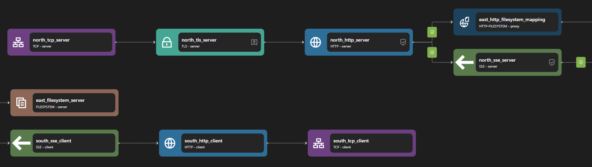

# SSE Proxy

## Overview

Zilla's SSE Proxy serves as a bridge between clients and backend services by managing, routing, and validating SSE traffic. It leverages an SSE Server binding to handle incoming client connections and an SSE Client binding to forward events to backend services, effectively functioning as a proxy for real-time event streaming.


## Key Capabilities

### Inbound and Outbound HTTP Streams

Zilla's SSE Proxy facilitates real-time communication by managing both inbound and outbound HTTP streams. It uses [SSE Server binding](../../../reference/config/bindings/sse/server.md) to accept client connections and [SSE Client binding](../../../reference/config/bindings/sse/client.md) to forward events to backend services. These bindings ensure efficient event-driven communication while abstracting complex connection handling.

### Advanced Request Routing

Zilla enables flexible request routing, allowing SSE messages to be directed dynamically based on custom rules. This ensures that events are efficiently routed to the appropriate backend services, optimizing performance and scalability.

### Authentication Validation

To enhance security, Zilla’s SSE Proxy supports JWT-based authentication through its [JWT guard](../../../reference/config/guards/jwt.md) mechanism. This validates tokens included in client requests, ensuring that only authorized users can access event streams. JWT guards provide fine-grained control over access policies and enhance data security.

### Schema Validation

Zilla ensures data integrity through [catalog-based schema validation](../../../reference/config/catalogs/), which enforces structured event formats before they reach backend services. By validating incoming and outgoing SSE messages against predefined schemas, Zilla prevents malformed data from being processed, improving reliability and maintaining consistency across event-driven architectures.

### Seamless AsyncAPI Integration

Zilla natively integrates with AsyncAPI to provide a standardized way of defining and documenting event-driven APIs. By leveraging [AsyncAPI bindings](../../../reference/config/bindings/asyncapi/README.md), Zilla ensures compatibility with modern microservices architectures and simplifies interoperability with other event-driven systems.

## Use Cases

### API Gateway

Zilla’s SSE Proxy can act as an API Gateway for event-driven applications, managing real-time event streams while enforcing authentication, schema validation, and routing policies. It ensures secure and efficient communication between clients and backend services, reducing backend load by handling persistent SSE connections.

### Multi-Tenant Systems

In multi-tenant architectures, Zilla enables event isolation and access control for different tenants. By leveraging JWT authentication and request routing, it ensures that each tenant only receives relevant event streams, enhancing security and scalability.

## Examples



Access the SSE Proxy example files here: [SSE Proxy Repository](https://github.com/aklivity/zilla-examples/tree/main/sse.proxy.jwt)

::: details Full SSE Proxy zilla.yaml Config

```yaml
---
name: example
vaults:
  my_servers:
    type: filesystem
    options:
      keys:
        store: tls/localhost.p12
        type: pkcs12
        password: ${{env.KEYSTORE_PASSWORD}}
guards:
  authn_jwt:
    type: jwt
    options:
      issuer: https://auth.example.com
      audience: https://api.example.com
      keys:
        - kty: RSA
          n: qqEu50hX+43Bx4W1UYWnAVKwFm+vDbP0kuIOSLVNa+HKQdHTf+3Sei5UCnkskn796izA29D0DdCy3ET9oaKRHIJyKbqFl0rv6f516QzOoXKC6N01sXBHBE/ovs0wwDvlaW+gFGPgkzdcfUlyrWLDnLV7LcuQymhTND2uH0oR3wJnNENN/OFgM1KGPPDOe19YsIKdLqARgxrhZVsh06OurEviZTXOBFI5r+yac7haDwOQhLHXNv+Y9MNvxs5QLWPFIM3bNUWfYrJnLrs4hGJS+y/KDM9Si+HL30QAFXy4YNO33J8DHjZ7ddG5n8/FqplOKvRtUgjcKWlxoGY4VdVaDQ==
          e: AQAB
          alg: RS256
          kid: example
        - kty: EC
          crv: P-256
          x: f83OJ3D2xF1Bg8vub9tLe1gHMzV76e8Tus9uPHvRVEU
          y: x_FEzRu9m36HLN_tue659LNpXW6pCyStikYjKIWI5a0
          alg: ES256
          kid: example_ec
      challenge: 10
bindings:
  north_tcp_server:
    type: tcp
    kind: server
    options:
      host: 0.0.0.0
      port: 7143
    exit: north_tls_server
  north_tls_server:
    type: tls
    kind: server
    vault: my_servers
    options:
      keys:
        - localhost
      sni:
        - localhost
      alpn:
        - h2
    exit: north_http_server
  north_http_server:
    type: http
    kind: server
    options:
      versions:
        - h2
      authorization:
        authn_jwt:
          credentials:
            headers:
              authorization: Bearer {credentials}
            query:
              access_token: "{credentials}"
      access-control:
        policy: cross-origin
    routes:
      - when:
          - headers:
              :scheme: https
              :authority: localhost:7143
              :path: /events
        exit: north_sse_server
      - when:
          - headers:
              :scheme: https
              :authority: localhost:7143
        exit: east_http_filesystem_mapping
  east_http_filesystem_mapping:
    type: http-filesystem
    kind: proxy
    routes:
      - when:
          - path: /{path}
        with:
          path: ${params.path}
        exit: east_filesystem_server
  east_filesystem_server:
    type: filesystem
    kind: server
    options:
      location: /var/www/
  north_sse_server:
    type: sse
    kind: server
    routes:
      - guarded:
          authn_jwt:
            - proxy:stream
        exit: south_sse_client
  south_sse_client:
    type: sse
    kind: client
    exit: south_http_client
  south_http_client:
    type: http
    kind: client
    options:
      versions:
        - http/1.1
    exit: south_tcp_client
  south_tcp_client:
    type: tcp
    kind: client
    options:
      host: sse-server
      port: 8001
telemetry:
  exporters:
    stdout_logs_exporter:
      type: stdout
```

:::

The above configuration is an example of an SSE proxy. It listens on https port 7143 and echos back whatever is published to `sse_server` on TCP port 7001.

The SSE Proxy can be constructed with two parts: the SSE server and the SSE client. When the SSE server receives a request, it creates an SSE stream connection request to external services through the SSE client based on the routing configuration. It sends and returns anything it receives.

The SSE server consists of the following bindings: TCP Server, TLS Server, HTTP Server, and SSE server. A TCP Server is required to open a specific port and allow inbound connections. A TLS server is optional but can be used to perform TLS encryption for HTTPS. The data stream is then passed to an HTTP server, which is also passed to an SSE server.

The SSE client consists of the following bindings: SSE client, HTTP client, TLS client, and TCP client. A TCP client is required to allow outbound TCP connections. A TLS client is optional but can be used to encrypt connections to outbound connections. An SSE client is used to perform an SSE request, which is then passed into an HTTP client.

::: note
Even though SSE is part of HTTP, it needs a separate binding layer on top of HTTP in Zilla.
:::
