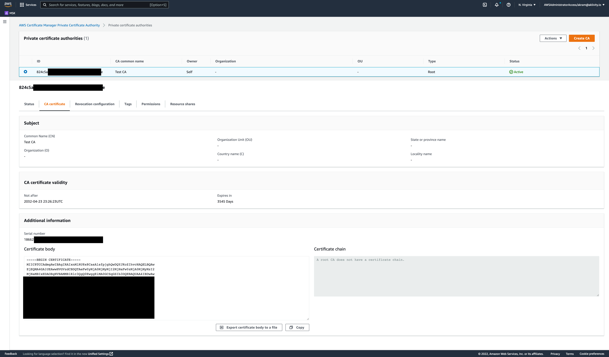

# Amazon MSK

Unlike other hosted Kafka services, Amazon MSK is not readily reachable over the internet. As a result, unless Zilla is deployed in the same VPC in which MSK is running, you will first need to make your cluster publicly accessible.

## Enable MSK Public Access

"Public Access" can be turned on for MSK clusters running Apache Kafka 2.6.0 or later. Follow the MSK [Public Access Guide](https://docs.aws.amazon.com/msk/latest/developerguide/public-access.html)to do so.

::: warning
MSK's “Public Access” feature directly exposes your brokers to the internet, which may present additional security concerns. An alternative and more flexible solution is the [Secure Public Access](../../zilla-plus-in-production/secure-public-access/) solution using [Zilla Plus for Amazon MSK](https://aws.amazon.com/marketplace/pp/prodview-jshnzslazfm44). The solution acts as intermediary that securely routes connectivity between external clients and MSK brokers without having to modify the broker configuration. Specifically, no broker configuration change is needed for advertised listeners.
:::

## Set up mTLS Authentication between MSK and Zilla

Once your MSK cluster is reachable over the internet, it will rely on `mTLS` to authenticate external clients. Setting up `mTLS` between MSK and Zilla is done in three steps:

1. Create a trusted Client Certificate in Amazon Certificate Manager.
1. Export the Client Certificate as well as the Certificate Authority (CA) Certificate.
1. Create a PKCS12 KeyStore containing the exported certificates that will be referenced by Zilla to complete the `mTLS` handshake with your MSK cluster.

::: info NOTE
If you deployed the Zilla Plus for Amazon MSK, then you should already have a Client Certificate that Zilla can use and you can go straight to the second step.
:::

### Create a Client Certificate

Follow the [Create Client Certificate guide](../../../resources/aws/create-client-certificate-acm.md). Upon completion you will have created a client certificate inside ACM and should have a local `client-1.key.pem` file containing the client certificate's RSA key as well as the `ARN` of the certificate.

### Export Client and CA Certificates

First, you will export the Client Certificate to a local file called `client.cert`. To do this you will need the `ARN` of the client certificate as well as of the [certificate authority](../../../resources/aws/create-certificate-authority-acm.md) used to issue the certificate, and run the following command:

```bash
aws acm-pca get-certificate --certificate-authority-arn CERTIFICATE_AUTHORITY_ARN \
--certificate-arn CERTIFICATE_ARN --output text
```

::: code-tabs

@tab output

```output:no-line-numbers
----BEGIN CERTIFICATE-----
MIIEdzCCA1+gAwIBAgIQDLtFK9uDUb6VpObjhusyhTANBgkqhkiG9w0BAQsFADAS
......
-----END CERTIFICATE-----

-----BEGIN CERTIFICATE-----
MIIC8TCCAdmgAwIBAgIRAIxnMlRU8x8CasAlsfpjghQwDQYJKoZIhvcNAQELBQAw
......
-----END CERTIFICATE-----
```

:::

Copy first certificate and save it as `client.cert`

::: code-tabs

@tab client.cert

```output:no-line-numbers
----BEGIN CERTIFICATE-----
MIIEdzCCA1+gAwIBAgIQDLtFK9uDUb6VpObjhusyhTANBgkqhkiG9w0BAQsFADAS
......
-----END CERTIFICATE-----
```

:::

Next, you will export the CA Certificate.

Log into your AWS Certificate Manager Private Certificate Authority and under "Additional Information" export the certificate body to a file called `ca.pem`



### Create a PKCS12 KeyStore

To create the KeyStore you will need a signed client certificate alias. It is best to use one of your MSK cluster's `bootstrap server names`.


With the `bootstrap server name` in hand, run the following command to create the `keystore.p12` file:

::: code-tabs

@tab keystore.p12

```bash
openssl pkcs12 -export -in client.cert -inkey client-1.key.pem \
-out keystore.p12 -name SIGNED_CLIENT_CERT_ALIES \
-CAfile ca.pem
```

:::

## Configure Zilla

The examples use the below Environment variables.

| Environment variable        | Description                                                                                                                     |
| --------------------------- | ------------------------------------------------------------------------------------------------------------------------------- |
| `KEYSTORE_PATH`             | The path to the local `keystore.p12` file that was generated above.                                                             |
| `TRUSTORE_TYPE`             | Keystore types such as `pkcs12`, `jceks`, and etc                                                                               |
| `KEYSTORE_PASSWORD`         | Keystore password to `keystore.p12` file that was generated above.                                                              |
| `SIGNED_CLIENT_CERT_ALIAS`  | A unique string that identifies the key cert entry chain in the `keystore.p12`. For example, use the MSK bootstrap server name. |
| `BOOTSTRAP_SERVER_HOSTNAME` | Target MSK hostname. For example: `b-2-public.myTestCluster.v4ni96.c2.kafka.us-east-1.amazonaws.com`                            |
| `BOOTSTRAP_SERVER_PORT`     | Target MSK port number. For example `9094`                                                                                      |

Inside `zilla.yaml` create a `client_vault` that references your newly created `keystore`. After this, reference the vault in the `south_tls_client` binding. Your `zilla.yaml` should appear as follows:

::: code-tabs#yaml

@tab zilla.yaml

```yaml
vaults:
  client_vault:
    type: filesystem
    options:
      trust:
        store: ${{env.TRUSTORE_PATH}}
        type: ${{env.TRUSTORE_TYPE}}
        password: ${{env.TRUSTORE_PASSWORD}}
bindings:
...
  south_kafka_client:
    type: kafka
    kind: client
    options:
      servers:
        - ${{env.KAFKA_BOOTSTRAP_SERVER}}
    exit: south_tls_client
  south_tls_client:
    type: tls
    kind: client
    vault: client_vault
    options:
      trust:
        - ${{env.CA_CERT_ALIAS}}
    exit: south_tcp_client
  south_tcp_client:
    type: tcp
    kind: client
```

:::

::: info NOTE
SNI adds the domain name to the TLS handshake process so that the Zilla process reaches the right domain name and receives the correct SSL certificate.
:::

To test the above config you can use it to add or replace the necessary bindings in the [http.kafka.sasl.scram](https://github.com/aklivity/zilla-docs/releases/latest/download/http.kafka.sasl.scram.tar.gz) cookbook.
