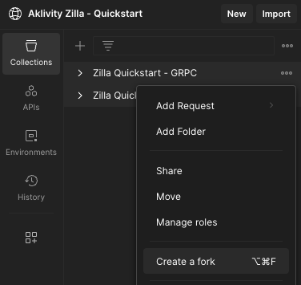

# Zilla Quickstart

Get started with Zilla by deploying our Docker Compose stack. Before proceeding, you should have [Docker Compose](https://docs.docker.com/compose/gettingstarted/) installed.

## Fork Postman Collections

This quickstart is designed to use Aklivity’s public [Postman Workspace](https://www.postman.com/aklivity-zilla/workspace/aklivity-zilla-quickstart/overview) to give you fast and easy way to try out Zilla’s multi-protocol capabilities.

There are two collections, one for HTTP proxying, which includes REST and SSE endpoints, and one for gRPC proxying. Fork each of these collections into your own workspace.

- [Zilla - REST Kafka proxy](https://www.postman.com/aklivity-zilla/workspace/aklivity-zilla-quickstart/collection/28401168-6941d1fa-698c-4da1-9789-2f806acf9fbb?action=share&creator=28401168)
- [Zilla - SSE Kafka proxy](https://www.postman.com/aklivity-zilla/workspace/aklivity-zilla-quickstart/collection/28401168-09c165b3-6e68-45c2-aedb-494f130bc354?action=share&creator=28401168)
- [Zilla - GRPC Server & Kafka proxy](https://www.postman.com/aklivity-zilla/workspace/aklivity-zilla-quickstart/collection/64a85751808733dd197c599f?action=share&creator=28401168)



::: info App or Desktop Agent
Once the collections are forked you can run them against the local stack if you have either the [Postman App](https://www.postman.com/downloads/) or [Postman Desktop Agent](https://www.postman.com/downloads/postman-agent/) installed.
:::


## Run Zilla and the Compose Stack

Download the [zilla.quickstart](https://github.com/aklivity/zilla-examples/tree/main/zilla.quickstart) folder from the zilla-examples repo. The docker compose file will create everything you need for this quickstart. The `setup.sh` script will start and restart the backend. The `teardown.sh` script stops and destroys all of the containers.

::: code-tabs#bash

@tab Start and Restart

```bash
./setup.sh
```

@tab Shutdown

```bash
./teardown.sh
```

:::

### Browse the Kafka topics

This Zilla quickstart hosts a UI for the Kafka cluster. Go to the [topics page](http://localhost/ui/clusters/local/all-topics) to browse the data.

- **items-crud** - HTTP CRUD messages
- **events-sse** - SSE event messages
- **echo-service-messages** - gRPC echo messages
- **route-guide-requests** - gRPC RouteGuide requests
- **route-guide-responses** - gRPC RouteGuide responses

## REST Kafka proxy

Zilla can expose common entity CRUD endpoints with the entity data being stored on Kafka topics. Leveraging the `cleanup.policy=compact` feature of Kafka, Zilla enables a standard REST backend architecture with Kafka as the storage layer. Adding a `Idempotency-Key` header during creation will set the message `key` and acts as the `ID` for the record. A UUID is generated if no key is sent.

- **GET** - Fetches all items on the topic or Fetch one item by its key using `/:key`.
- **POST** - Create a new item with the `Idempotency-Key` header setting the key. 
- **PUT** - Update an item based on its key using `/:key`.
- **DELETE** - Delete an item based on its key using `/:key`.

::: note Going Deeper
Zilla can be configured for request-response over Kafka topics both synchronously and asynchronously, and more that we aren't able to cover in this quickstart. Here are some other interesting examples you will want to check out.

- [http.proxy](https://github.com/aklivity/zilla-examples/tree/main/http.proxy)
- [http.echo.jwt](https://github.com/aklivity/zilla-examples/tree/main/http.echo.jwt)
- [http.kafka.async](https://github.com/aklivity/zilla-examples/tree/main/http.kafka.async)
- [http.kafka.cache](https://github.com/aklivity/zilla-examples/tree/main/http.kafka.cache)
- [http.kafka.sync](https://github.com/aklivity/zilla-examples/tree/main/http.kafka.sync)
:::

## SSE Kafka proxy

Zilla can expose a Kafka topic as a Server-sent Events (SSE) stream, enabling a resilient event-driven architecture to be exposed over HTTP. This quickstart will demonstrate streaming data to one session while posting data from another using Zilla and Kafka as the backend.

- **POST** - Push a new event.
- **GET:SSE** - Stream all of the events published on the `event-sse` Kafka topic.

::: note Going Deeper
Zilla can be configured for more usecases that we aren't able to cover in this quickstart. Here are some other interesting examples you will want to check out.

- [sse.kafka.fanout](https://github.com/aklivity/zilla-examples/tree/main/sse.kafka.fanout)
- [sse.proxy.jwt](https://github.com/aklivity/zilla-examples/tree/main/sse.proxy.jwt)
:::

## GRPC Server & Kafka proxy

Zilla supports the gRPC protocol to proxy services and service methods using the Protobuf service definition. Zilla can act as a direct proxy and a proxy for message binaries onto and off of Kafka topics.

### gRPC server proxy

Zilla can route individual service methods. The `GetFeature` method of this quickstart is proxied directly to the running RouteGuide server. This server enables `gRPC reflection`, which is being used for this request in the quickstart.

- **GetFeature** - Proxy gRPC directly to the server.

### gRPC Kafka proxy

Zilla maps the service method's request and response messages directly to Kafka topics. This can include simple RPC request-response messages, but this quickstart demonstrates `Server-side`, `Client-side`, and `Bidirectional` streaming RPC to a running gRPC server through the `ListFeature`, `RecordRoute`, and `RouteChat`, respectively. Zilla is routing all of the messages from the client to the server through Kafka. You can match the individual service calls on the [topics](#browse-the-kafka-topics) by the matching `key` UUIDs which come from the `zilla:correlation-id` header.


- **RouteGuide** - Proxy messages through Kafka to a running gRPC server.
- **EchoService** - Zilla implements a simple message echo service.


::: note Going Deeper
Zilla can be configured for more usecases that we aren't able to cover in this quickstart. Here are some other interesting examples you will want to check out.

- [grpc.proxy](https://github.com/aklivity/zilla-examples/tree/main/grpc.proxy)
- [grpc.kafka.fanout](https://github.com/aklivity/zilla-examples/tree/main/grpc.kafka.fanout)
- [grpc.kafka.proxy](https://github.com/aklivity/zilla-examples/tree/main/grpc.kafka.proxy)
:::

## Check out the Prometheus Metrics

This Zilla quickstart collects basic metrics for the [streaming](../../reference/config/telemetry/metrics/metric-stream.md), [HTTP](../../reference/config/telemetry/metrics/metric-http.md), and [gRPC](../../reference/config/telemetry/metrics/metric-grpc.md) services. Go to [http://localhost:9090/metrics](http://localhost:9090/metrics) to see the collected data.

## Going Deeper

Try out the other [Zilla examples](https://github.com/aklivity/zilla-examples) to learn more about what Zilla can do.
