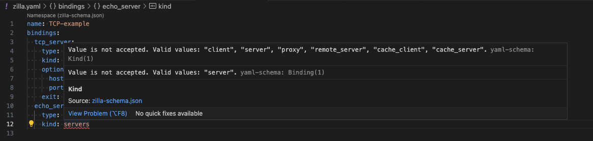
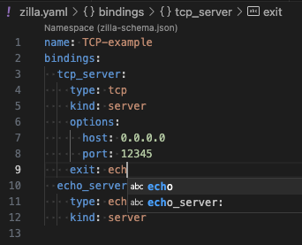

# Build and Visualize: The Zilla VS Code Extension

The Zilla Visual Code Extension simplifies Zilla configuration file management and visualization directly within VS Code. The extension includes:

1. [**Zilla Diagram**](#zilla-diagram) visually represents your Zilla config, similar to a network diagram. It displays all of the configured Zilla elements and how they connect.
2. [**YAML IntelliSense**](#yaml-intellisense) helps you write and maintain your [zilla.yaml](../../reference/config/overview.md) config.

## How to Install

Search for the official Zilla extension on the **Extensions** tab in VS Code or visit the [VS Code Marketplace](https://marketplace.visualstudio.com/items?itemName=aklivity.zilla-vscode-ext).

## Extension Features

### Zilla Diagram

This feature provides an interactive visualization of your `zilla.yaml` configuration. To activate this, click the `Toggle Diagram View`  button in the top right corner.

#### Features

- Clicking anywhere on the diagram will take your cursor to that location in the `zilla.yaml` file.
- the `?` icon that appears on a clicked element will take you to the appropriate docs page
 
- Missing connections and errors can be seen in the diagram view.
 

#### Controls

- The `Add` dropdown lets you create new elements in the `zilla.yaml` file.
- The `Export` dropdown lets you download your diagram.
- the View switch will toggle between side-by-side and top-bottom layouts.

### YAML IntelliSense

The YAML IntelliSense feature enhances your editing experience with:

1. Property and Value validation highlighting

2. Syntax and Context-aware autocomplete

## Zilla Extension with `vscode.dev`

The Zilla extension can be installed on `vscode.dev` for users who don't have it installed on their local environment.

1. Go to [vscode.dev](https://vscode.dev/)
2. Search for the `Zilla VSCode` extension and install it
3. Create a `zilla.yaml` file and paste your configuration.
4. The extension will automatically render the diagram.

### Browsing GitHub Repositories

1. Navigate to [vscode.dev/github/aklivity/zilla-examples](https://vscode.dev/github/aklivity/zilla-examples) to open the `zilla-examples` repository.
2. Sign in to your GitHub account.
3. The Zilla extension will appear in the **Recommended Extensions** section.
4. Explore any `zilla.yaml` file from the examples.

